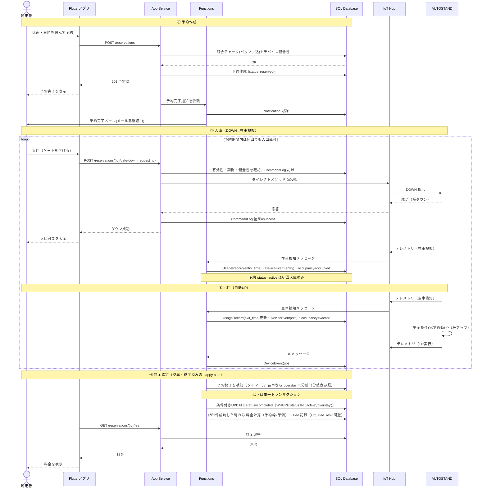

# 駐車場予約システム シーケンス図（MVP コアフロー）

MVP の中核フロー「予約作成 → 入庫（DOWN→在車検知）→ 出庫（自動 UP）→ 料金確定」を、利用者・Flutter アプリ・App Service・Functions・SQL Database・IoT Hub・AUTOSTAND の間のメッセージとして時系列で示します。

> 改訂：在車・空車検知時の `UsageRecord`（入出庫記録）の読み書きを追加、料金確定を「空車・終了済みの happy path」と明示（在車なら overstay の注記）、`status=active` は初回入庫のみである注記、予約完了メールのメール基盤経由表記を追加。

## シーケンス図（mermaid）

---

## フローの説明

### ① 予約作成
利用者がアプリで区画と日時を選び、App Service が予約作成リクエストを受ける。App Service は SQL で競合チェック（バッファ込み、§4.3.2）とデバイス健全性（§8）を確認し、問題なければ予約を `reserved` で作成する。アプリへ即時応答したうえで、Functions が予約完了通知（メール基盤経由）を非同期で送り、Notification を記録する。

### ② 入庫（DOWN → 在車検知）
利用者が「入庫」を操作すると、App Service が予約の有効性・期間・デバイス健全性を確認し、冪等キー（request_id）つきで CommandLog を記録してから、IoT Hub のダイレクトメソッドで AUTOSTAND に DOWN を指示する。デバイスは板を下げて成功応答を返し、App Service が CommandLog の結果を更新する。車両が入ると AUTOSTAND が在車テレメトリを送り、Functions が `UsageRecord(entry_time)` を挿入し、DeviceEvent(entry)・区画の在車状態を更新する。予約 `status=active`（利用中）への更新は初回入庫のみで、2 回目以降や一時外出からの再入庫では active を維持する（§4.3.1）。

### ③ 出庫（自動 UP）
車両が出ると AUTOSTAND が空車テレメトリを送り、Functions が当該 `UsageRecord` の `exit_time` を更新し、DeviceEvent(exit)・在車状態を更新する。AUTOSTAND は空車検知と安全条件（§5.3）を満たして自動的に板を上げ、UP テレメトリを送る。Functions が DeviceEvent(up) を記録する。②③は予約期間内であれば何回でも繰り返せる（F4-4）。

### ④ 料金確定（happy path）
本図は「終了時刻時点で既に出庫済み（空車）」の経路を示す。予約終了時刻の到来を Functions のタイマーが検知し、空車・終了済みなら **単一トランザクション**で「条件付き UPDATE（`status=completed` WHERE `status IN ('active','overstay')`）が 1 件成功した時のみ Fee を INSERT」する。この順序により、`completed` にしたが Fee 未記録、という中断（超過フローが懸念するケース）はトランザクションのアトミック性で防がれ、`UQ_Fee_resv` の二重 INSERT も条件付き UPDATE の勝者のみが INSERT することで防がれる。終了時刻に在車のままなら `overstay` に分岐し、出庫後に同じ方式で完了＋超過料金を確定する（分岐表参照）。利用者はアプリから料金を確認できる。

---

## 設計メモ

- DOWN は同期応答が必要なユーザー操作のため、App Service が IoT Hub のダイレクトメソッドを直接呼ぶ構成とした。デバイス命令ロジックを Function に寄せる構成（App Service → Functions → IoT Hub）も可で、その場合は要件 §2.2 の記述と完全一致する。
- 在車・空車・UP などテレメトリ駆動の処理は Functions が担当し、SQL の予約状態・UsageRecord・DeviceEvent・在車状態を更新する。
- `DeviceEvent` は監査用、`UsageRecord` は業務記録（ノーショー判定・料金根拠）という役割分担。在車検知で UsageRecord を書くことで、§4.3.1 の「ノーショー判定は入庫記録の有無で行う」と整合する。
- `loop` は「予約期間内は何回でも入出庫」（F4-4）を表す。再入庫のたびに DOWN 指示が必要。
- 予約完了メールはメール基盤（Azure Communication Services 等、§2.3）経由で送る。

---

## 主な分岐（本図では省略、happy path 以外）

| 分岐 | 概要 | 参照 |
| --- | --- | --- |
| DOWN 失敗 | デバイス応答なし／オフライン／物理占有中は失敗。リトライ → タイムアウト → 失敗通知＋サポート導線。CommandLog の冪等キーで二重発火を防止。 | F4-6 / F4-7 |
| 入庫待ちタイムアウト | DOWN 後に入庫がない場合、安全条件（連続無検知＋動作直前の再確認）を満たして自動 UP。 | §5.3 |
| ノーショー | 開始から一定時間、入庫記録（UsageRecord）がなければ `no_show` とし区画を解放。 | §4.3.1 |
| 超過 | 予約終了時刻に在車なら `overstay`（板ダウン維持）。出庫（空車検知）で `completed` ＋超過料金を確定。 | §4.3.1 / §5 |
| 利用終了申告 | 利用者が明示的に利用終了を申告して完了させる経路（出庫検知による自動完了とは別経路）。 | F4-8 |

---

## 詳細設計メモ（記録のみ）

- DOWN のダイレクトメソッドはデバイス接続を前提とする同期呼び出し。`H-->>API: 応答` の同期待ちにはタイムアウト値を設定し、超過（オフライン等）時は F4-6 の失敗導線へ回す。
- ④ の終了処理は §5.4 の状態機械に従い、空車・終了済み → `completed`、在車 → `overstay` に分岐する。本図は前者のみを描いている。