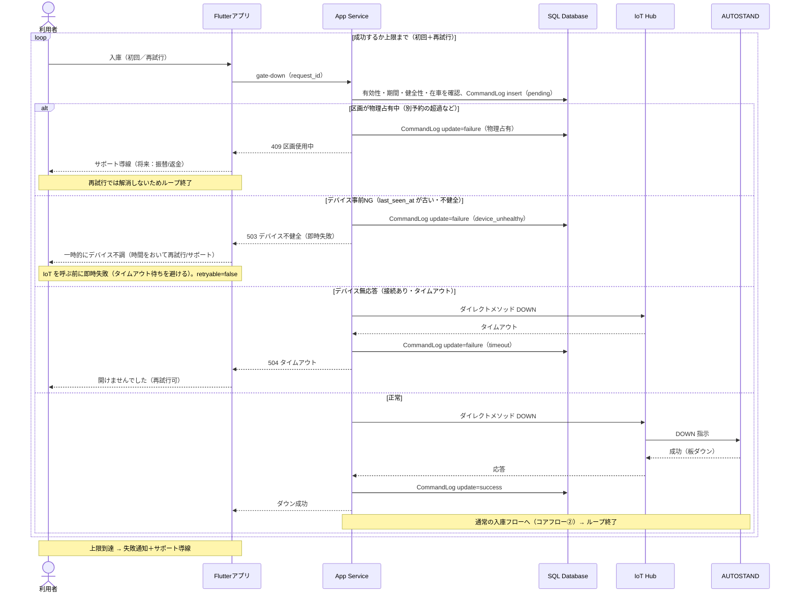

# 駐車場予約システム シーケンス図（DOWN 失敗フロー・F4-6）

入庫時の DOWN 指示が失敗するケース（要件 F4-6）の分岐を時系列で示します。`loop`（成功するか上限まで）の中に「gate-down → 分岐」を1サイクルとして置き、各分岐の抜け先を明示しています。

> 改訂：リトライの `loop` を分岐の外側に巻き直し、正常時の抜け先（コアフロー②）を明示。CommandLog を全経路で「pending insert → 結果 update」に統一。デバイス事前NG（即時失敗）と接続あり無応答（タイムアウト）を区別。

## シーケンス図（mermaid）

---

## フローの説明

各試行は「gate-down 受信 → 確認＋CommandLog を pending で記録 → 分岐」を1サイクルとし、`loop` で初回と再試行を包む。

- **正常**：DOWN が成功し、CommandLog を success に更新。通常の入庫フロー（コアフロー②）へ抜けてループ終了。
- **デバイス事前NG（不健全・即時失敗）**：`Device.last_seen_at` が健全性閾値（§12 #14, 仮 N 分）を超えて古い場合、IoT を呼ぶ前に即時失敗。CommandLog を failure（device_unhealthy）に更新し、**503**（`retryable=false`）を返す。タイムアウト待ち（504）を避けるのが要点で、OpenAPI の 503/504 の区別に対応する。
- **デバイス無応答（接続あり・タイムアウト）**：ダイレクトメソッドを送ったが応答が返らずタイムアウト。CommandLog を failure（timeout）に更新し、**504**（`retryable=true`）で利用者は再試行できる（ループ継続）。上限到達で失敗通知＋サポート導線。
- **区画が物理占有中**：前の利用者の超過などで区画が塞がっている（§4.3.2 の残存リスク）。IoT を呼ぶ前に在車状態で即時拒否し、CommandLog を failure（物理占有）に更新。再試行では解消しないためループ終了し、サポート導線（将来：振替/返金）へ。

---

## 設計メモ

- CommandLog は全経路で「要求受信時に pending を1行 insert → 結果で update」に統一する。経路によって行数が揺れない。
- 冪等キー（`COMMAND_LOG.request_id`、F4-7）の方針：1回の送信操作（初回タップ／再試行タップ）ごとに新規 request_id を採番し、CommandLog は試行ごとに1行（per-attempt 監査が明確）。同一送信のトランスポート再送（ネットワーク再試行・二重タップ）は同一キーを共有し、サーバ／デバイスで重複指示を吸収して物理動作の二重発火を防ぐ。
- デバイス事前 NG（`last_seen_at` が古い＝不健全）は、確認時点で DOWN を送らずタイムアウトを待たずに即時失敗を返す（UX 上、数十秒の待ちを省ける）。本図の「無応答」分岐は、接続はあるが応答が返らないケースを示す。
- 物理占有判定（MVP）：在車状態（`PARKING_SPOT.occupancy`）が `occupied` なら一律拒否し、再入庫は `vacant` 反映後のみ許可する。自分の出庫直後はテレメトリ反映の遅延で短時間 `occupied` のまま弾かれ得る（§8 の更新タイミングと連動）。「occupied かつ自分の予約に紐づかない在車のみ拒否」とする賢い判定は Phase 2／詳細設計とする。
- DOWN の同期待ちにはタイムアウト値を設定する（コアフロー詳細設計メモと整合）。

---

## 詳細設計メモ（記録のみ）

- HTTP ステータス：物理占有＝409 Conflict（`retryable=false`）、デバイス事前NG（不健全）＝503（`retryable=false`・即時失敗）、無応答＝504（`retryable=true`）を割り当てる（OpenAPI の gate-down 定義と一致）。物理占有は 423 Locked / 503 も候補だが流儀の範囲で、409 で問題ない。
- 再試行の上限回数・間隔（バックオフ）は詳細設計で確定する。