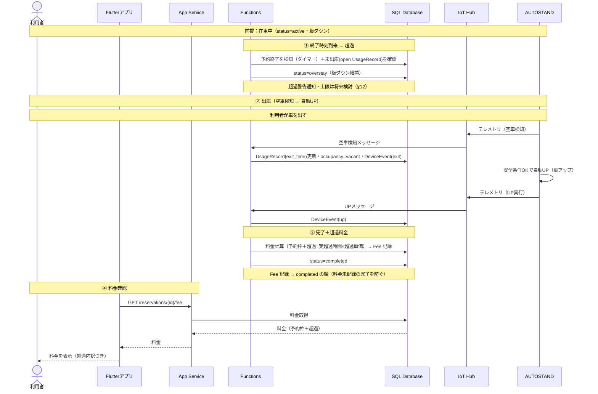

# 駐車場予約システム シーケンス図（超過フロー）

予約終了時刻に在車のままだった場合（overstay）の流れを時系列で示します。これはコアフロー④「予約終了をタイマー検知」の**在車側の分岐**にあたります（空車側は `completed` 直行＝コアフロー、在車側が本図）。

> 改訂：超過判定を「未出庫（open UsageRecord）」基準に統一、出庫を空車テレメトリ起点に表記統一、完了処理を「Fee 記録 → completed」の順に修正、超過時間の計算式を明記。

## シーケンス図（mermaid）

---

## フローの説明

### ① 終了時刻到来 → 超過
Functions のタイマーが予約終了時刻の到来を検知し、未出庫（`exit_time` 未記録の `UsageRecord` が開いている）であれば予約を `overstay` にする。判定ソースは遅延し得る occupancy ではなく「開いている UsageRecord の有無」を用いる（後述）。車両がいるためロック板はダウンを維持する（§5）。超過警告の通知や超過の上限・エスカレーションは将来検討（§12 #12）。

### ② 出庫（空車検知 → 自動 UP）
利用者が車を出すと AUTOSTAND が空車テレメトリを送る。Functions は当該 `UsageRecord` の `exit_time` を更新し、occupancy を vacant に、DeviceEvent(exit) を記録する。AUTOSTAND は空車検知と安全条件（§5.3）を満たして自動的に板を上げ、UP テレメトリを送り、DeviceEvent(up) が記録される。

### ③ 完了＋超過料金
出庫が確定したので、Functions は料金を「予約枠料金 ＋ 超過料金（実超過時間 × 超過単価）」で計算して Fee に記録し、その後に予約を `completed` にする（料金未記録の完了を防ぐ順序）。超過分は `FEE.overstay_fee` に計上される（F5-1 / F5-3）。

### ④ 料金確認
利用者はアプリから料金を確認できる。超過分を含む内訳が表示される。

---

## 設計メモ

- 本フローはコアフロー④の在車側分岐（§5.4）。タイマーが終了時刻を検知した時点で、空車・終了済みなら `completed`（コアフロー）、未出庫（在車）なら `overstay`（本図）に分岐する。
- **超過判定のソース**：occupancy（テレメトリ反映が遅延し得る）ではなく「終了時刻時点で `exit_time` 未記録の `UsageRecord` が開いているか」で判定する。これにより、出庫直後の occupancy 遅延による誤判定を避ける（§8 の更新タイミングと連動）。
- **超過時間の定義**：`超過時間 = max(0, 最終 exit_time − end_time)`。一時外出で複数入出庫がある場合は最終の `exit_time` を用いる。これで F5-3 の「実時間ベース」が計算式として一意になる。
- 超過中はロック板ダウンを維持する（在車中＝板ダウン）。出庫の空車検知で自動 UP（§5.3）。
- 料金は完了時に確定する。通常時は `overstay_fee=0`、超過時は実超過時間 × 超過単価を加算する。
- 出庫まで Fee は未記録のままで、`GET /fee` は確定待ち（`pending`）を返し続ける。超過が長期化すると pending も長期化し得る（上限・通知は §12 #12）。
- 利用終了メール（超過料金の案内を含む）は Phase 2（F4-9）。本図では描かない。
- 超過単価・超過の上限は業務判断のため仮置き（§12 #1 / #12）。

---

## 詳細設計メモ（記録のみ）

- 完了処理は「Fee 記録 → `completed`」の順、または同一トランザクションで束ねる。`completed` にしたが Fee 記録前に中断する「料金未記録の完了」を避ける。