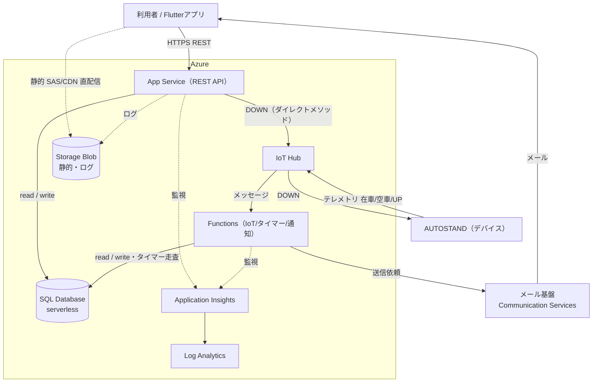

# 駐車場予約システム Azure 構成・デプロイ設計

これまでの設計（DOWN は App Service→IoT Hub ダイレクトメソッド、テレメトリは IoT Hub→Functions、通知はメール基盤経由）をリソース配置に落としたもの。

> 改訂：自動停止の resume とテレメトリ取りこぼし対策（接続リトライ＋IoT 再配信）を追加、偽 504 を避ける DOWN タイムアウトの境界、静的コンテンツを Blob 直配信に変更、IoT Hub F1 の制約・Key Vault のマネージド ID・連番 SQL マイグレーションをデプロイ手順に明記。

## 構成図（mermaid）

---

## リソースと役割

| リソース | プラン（方針） | 役割 |
| --- | --- | --- |
| App Service | Free/B1 など | TypeScript REST API のホスト。IoT Hub のダイレクトメソッド呼び出し元 |
| Functions | 従量課金（Consumption） | IoT メッセージ処理・タイマー走査・通知。IoT Hub トリガとタイマートリガ |
| SQL Database | サーバーレス（自動停止有効） | 会員・予約・利用記録・料金・各ログの永続化 |
| Storage（Blob） | LRS | 区画写真・規約/FAQ などの静的コンテンツ（直配信）、ログ |
| IoT Hub | Free（F1） | デバイスとの双方向通信（D2C テレメトリ／C2D ダイレクトメソッド） |
| Application Insights | 無料枠＋サンプリング | API・関数の監視（リクエスト・例外・依存関係） |
| Log Analytics | 無料枠＋保持期間設定 | ログ集約・KQL 分析 |
| Communication Services（メール） | 従量 | メール送信基盤（§12 #7 で選定） |

## データ・制御の流れ

- **予約・参照（HTTP）**：Flutterアプリ → App Service（REST）→ SQL Database。
- **静的配信**：区画写真・規約などは Blob から SAS/CDN で直接配信し、App Service を介さない（API リソースを消費しない）。
- **DOWN 指示（制御・同期）**：アプリ → App Service → IoT Hub のダイレクトメソッド → AUTOSTAND。結果は同期応答。
- **テレメトリ（D2C・非同期）**：AUTOSTAND（在車/空車/UP）→ IoT Hub の組み込みエンドポイント → Functions（IoT Hub トリガ）→ SQL Database。
- **ライフサイクル走査（タイマー）**：Functions（タイマー）→ SQL Database（ノーショー・超過・自動完了・トークン掃除）。
- **通知**：Functions → メール基盤 → 利用者。
- **監視**：App Service・Functions → Application Insights → Log Analytics。ログ保管は Blob も併用。

## 自動停止・コールドスタートと信頼性（重要）

無料枠の自動停止・コールドスタートは、コストだけでなく**信頼性**にも関わる。§12 #9 はその両面の綱引きとして捉える。

- **SQL サーバーレスの resume**：DB が一時停止中に Functions（テレメトリ・タイマー）が接続すると、復帰（resume）に数十秒かかる間、最初の接続が失敗し得る。対策として **Functions の DB アクセスは接続リトライ（指数バックオフ）前提**とし、IoT Hub トリガは失敗時に再試行・再配信される設定にして、「resume 待ちの一時失敗 → リトライ／再配信で吸収」とする。これが無いと自動停止のたびに在車検知を取りこぼす。
- **App Service のコールドスタート vs 偽 504**：DOWN は App Service が IoT Hub ダイレクトメソッドを同期で呼ぶため Functions のコールドスタートは受けないが、App Service 自体が Free だとアイドル復帰で数秒待たされる。**DOWN 同期待ちのタイムアウトは App Service の復帰時間より十分長く**取り、「アプリが温まる前の初回 DOWN」が F4-6 の 504（デバイス無応答）と誤認されないようにする。

## 無料枠・コスト方針

> 無料枠の具体的な上限（メッセージ数・取り込み量・保持期間など）は変動するため、デプロイ時に Azure の料金ページで最新値を確認する。

- **IoT Hub Free（F1）**：1日あたりのメッセージ数に上限があるため、テレメトリ送信頻度を抑える（状態変化時のみ送る等）。
- **SQL サーバーレス**：アイドル時の自動一時停止でコストを圧縮。ただしタイマー走査が頻繁だと DB が起き続け、自動停止の効果と綱引きになる（§12 #9）。検知間隔を粗くする／次の期限に合わせて起こす方式を検討。
- **Functions（Consumption）**：無料グラントの実行回数・実行時間内に収める。
- **Application Insights / Log Analytics**：サンプリングと保持期間短縮で取り込み無料枠に収める。
- **App Service**：Free プランはコールドスタート・常時稼働制限あり。学習なら Free か B1。

## デプロイの流れ

1. **DB スキーマ適用**：`parking-reservation-schema.sql` ＋ 認証の追加テーブル（`RefreshToken` 等）を適用。スキーマ変更は**連番 SQL ファイル**（例 `001_init.sql` / `002_add_refresh_token.sql`）で管理し、dev/prod に「どこまで当てたか」を追える簡易マイグレーション運用にする（ツール導入は任意）。適用済みバージョンを記録する小テーブル（例 `SchemaMigrations(version, applied_at)`）を置けば、手動運用でも「prod は 002 まで」を確実に追える。
2. **バックエンド**：App Service（REST API）と Functions をビルドしてデプロイ（zip deploy / GitHub Actions / VS Code 拡張）。
3. **IoT Hub**：デバイス（擬似 AUTOSTAND）を登録し接続文字列を発行。組み込みエンドポイントを Functions の IoT Hub トリガに紐づけ。
4. **設定・シークレット**：MVP は App Settings に格納（簡便）。Key Vault を使う場合は App Service / Functions に**マネージド ID を有効化し、Key Vault 参照**で読む（アクセスポリシー設定が前提）。
5. **フロント**：Flutter アプリをビルドし、API のベース URL を環境ごとに設定。
6. **環境分離**：dev / prod で設定を分離。ただし **IoT Hub Free（F1）はサブスクリプションあたり1個・本番不可**のため、環境分離の対象から IoT Hub を外す（実機/擬似デバイス連携は dev のみ、prod は擬似デバイスのみ）か、prod は Basic/Standard を使う。IaC（Bicep / Terraform）化は任意。

## 設計メモ・未決

- IoT Hub のメッセージは組み込みエンドポイント（Event Hub 互換）を Functions の IoT Hub トリガで受ける。カスタムルーティングは MVP では不要。
- DOWN は C2D ダイレクトメソッド（双方向・同期）、テレメトリは D2C メッセージ（非同期）。
- 静的コンテンツは Blob 直配信（SAS/CDN）。App Service を介さない。
- メール基盤の選定（Communication Services か外部か）は §12 #7。
- サーバーレス自動停止とタイマー間隔・信頼性の整合は §12 #9（上記「信頼性」節）。
- シークレット管理に Key Vault を使うか App Settings 止まりかは規模次第（学習段階は App Settings でも可。Key Vault ならマネージド ID 前提）。