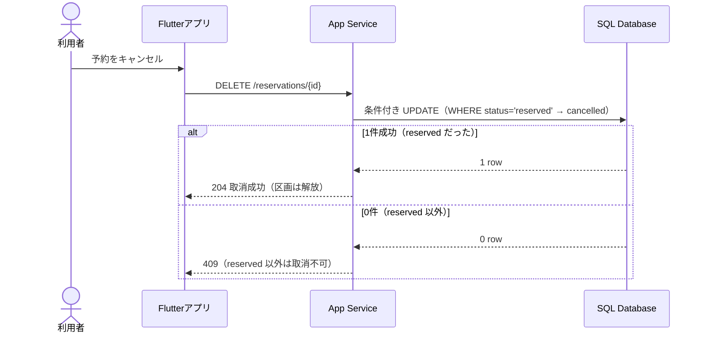
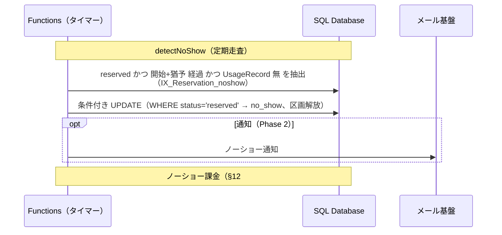
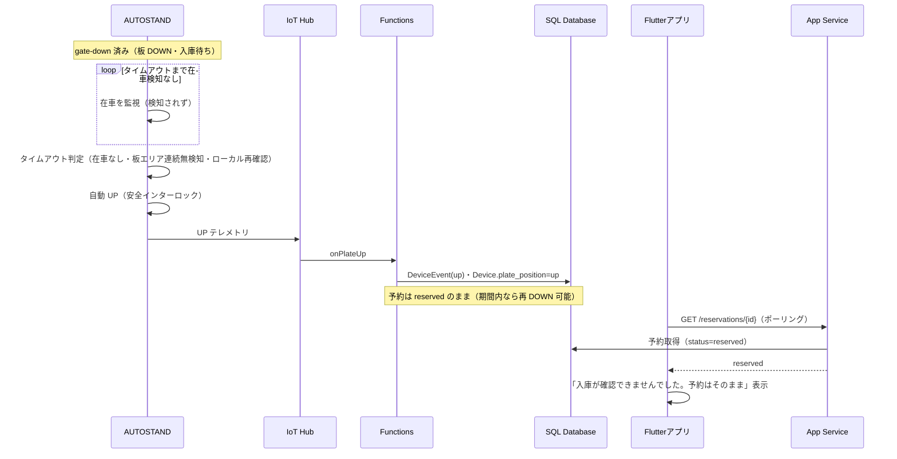

# 駐車場予約システム 残りのフロー図（キャンセル／ノーショー／入庫待ちタイムアウト）

コアフロー・DOWN 失敗・超過に続く、ライフサイクルの残りのフロー。これまでの設計（条件付き UPDATE、open UsageRecord 判定、§5.3 の安全インターロック、入庫待ちの UI 反映）と整合。

## 1. キャンセル

reserved のみ取消可。条件付き UPDATE で 0 件なら 409。DOWN 未発行のためデバイス操作は無く、料金も発生しない。キャンセルポリシー（§12 #2）は別途。

## 2. ノーショー

タイマー（detectNoShow）が「reserved かつ開始＋猶予経過かつ UsageRecord 無」を抽出し、条件付き UPDATE で no_show にして区画を解放。通知は Phase 2、ノーショー課金は §12 #3 で未決。

## 3. 入庫待ちタイムアウト

DOWN 後に在車検知が来ないまま §5.3 のタイムアウトに達すると、デバイスが安全インターロック（在車なし・板エリア連続無検知・ローカル再確認）を満たして自動 UP。クラウドは onPlateUp で記録。予約は reserved のままで、UI はポーリングで「入庫が確認できませんでした」を表示する。

## メモ

- いずれも状態遷移は条件付き UPDATE（現在状態を WHERE に含める）で行い、競合・二重処理を防ぐ。
- 入庫待ちタイムアウトの自動 UP はデバイス側（§5.3 の安全インターロック）。クラウドは記録のみで予約状態は変えない。
- ノーショーの猶予時間（§12）・課金（§12 #3）・キャンセルポリシー（§12 #2）は未決事項として残る。
- 入庫待ちタイムアウト（§12 #11, 仮5分）は、ノーショー猶予（仮30分）より短く保つこと。逆転すると「DOWN を試して失敗したのに先にノーショー確定」という妙な順序になる。§12 確定時に大小関係（入庫待ちタイムアウト < ノーショー猶予）を維持する。