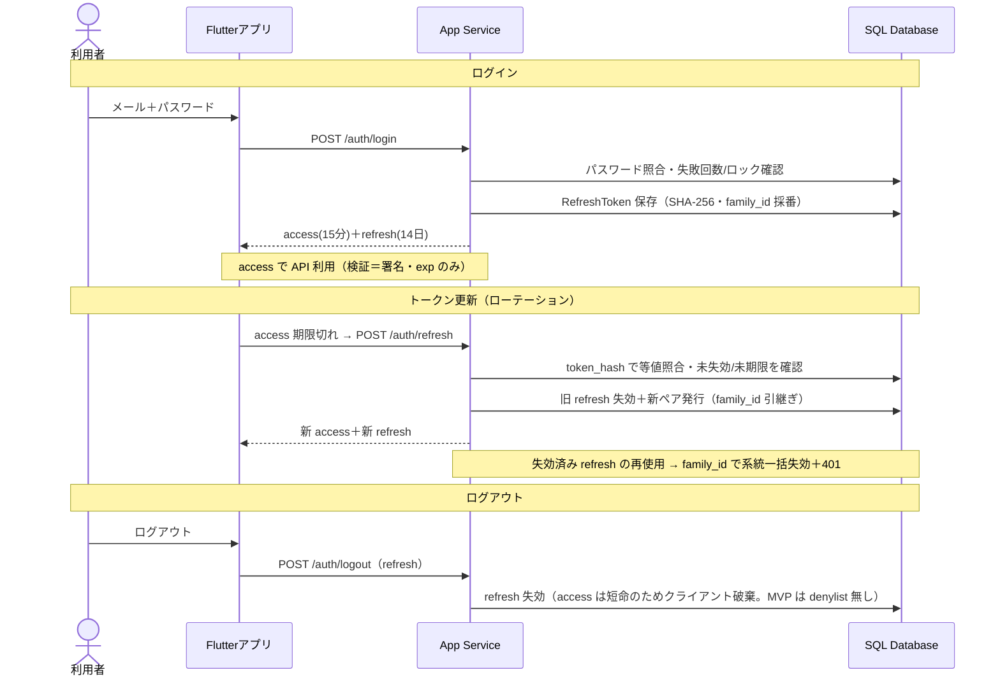

# 駐車場予約システム 認証設計（自前 JWT）

要件 §6.1・§12 #6 と OpenAPI の `/auth/*` を具体化したもの。方針は **自前 JWT を採用**。

> 改訂：リフレッシュ照合を「ソルト無し SHA-256＋token_hash の UNIQUE 索引で等値照合」に明確化、系統失効用に `family_id` を追加、MVP では access の denylist を持たない方針に決定（logout は refresh 失効のみ）、RefreshToken の定期掃除を追加。

## 1. 方針決定：自前 JWT か Entra External ID か（§12 #6）

| 観点 | 自前 JWT | Microsoft Entra External ID |
| --- | --- | --- |
| 学習価値 | 高（発行・検証・更新・失効を自作して理解） | 低（認証を委譲） |
| 実装コスト | 中〜高 | 低（設定中心） |
| 運用（鍵管理・失効） | 自分で担う | マネージド |
| ソーシャル/MFA | 自作が必要 | 標準装備 |
| コスト | 無料枠内で自前運用 | 無料枠あり（MAU 上限あり） |

**選択：自前 JWT。** 学習目的でトークンのライフサイクルを自作して理解する価値が大きい。運用委譲や本番のソーシャル・MFA が要る場合は Entra External ID に差し替え可能で、その際も `/auth/*` の契約は概ね維持できる。

## 2. トークン設計

| 種別 | 形式 | 寿命（仮） | 保存 | 備考 |
| --- | --- | --- | --- | --- |
| アクセストークン | JWT（HS256） | 15分 | クライアント保持（ステートレス） | claims: `sub`(user_id), `iat`, `exp`（`jti` はトレース用に任意）。多サービス検証なら RS256 |
| リフレッシュトークン | 不透明ランダム文字列（高エントロピー） | 14日 | サーバ側に **SHA-256（ソルト無し）でハッシュ保存** | 等値照合で1行を引く（§7）。使用時ローテーション（ワンタイム）、`family_id` で系統管理 |

- 署名鍵は App Settings / Key Vault に置く（リポジトリに置かない）。
- リフレッシュは高エントロピーの乱数なので辞書攻撃の対象にならず、**ソルト無し SHA-256 で十分**かつ決定的なので等値照合が速い（パスワードの bcrypt とは要件が異なる）。

## 3. エンドポイント別フロー（OpenAPI `/auth/*` に対応）

| エンドポイント | 処理 |
| --- | --- |
| POST /auth/register | パスワードを bcrypt でハッシュ→User 作成→アクセス＋リフレッシュ発行（family_id 採番） |
| POST /auth/login | パスワード検証、レート制限/ロック確認→発行（family_id 採番）。失敗はカウント（429 でロック） |
| POST /auth/refresh | 提示値を SHA-256 して `token_hash` で等値照合・未失効・未期限を確認→ローテーション（旧失効＋新ペア発行、`family_id` 引継ぎ）→返却。**失効済みの再使用は `family_id` で系統一括失効＋401** |
| POST /auth/logout | ボディの refresh を失効（`revoked_at`）。アクセスはクライアント破棄（MVP は denylist 無し） |

> **ローテーションの並行制御**：同一の有効な refresh が同時に2回提示される（クライアントのリトライ・二重タブ）と、両方が「未失効」を読み、片方の失効でもう片方が「失効済みの再使用」と誤検知され、正規ユーザーなのに系統一括失効＋401 で全セッションが飛ぶ古典的な罠がある。対策として、旧トークンの失効は条件付き UPDATE（`WHERE id=@id AND revoked_at IS NULL`）で行い、**1件成功した側だけが新ペアを発行**する。0件だった側は「失効済みトークンの再使用」とみなし、`token_reused`（401）として **`family_id` 単位で系統一括失効**する（盗難・複製を即座に締め出す安全側の方針）。本プロジェクト共通の「現在状態を WHERE に含めた条件付き UPDATE で遷移し、更新0件＝競合とみなす」原則を refresh にも適用する。
>
> 方針の補足（MVP 決定）：正規クライアントが同一 refresh を二重送信（リトライ・二重タブ）すると、0件側が誤って `token_reused` となり再ログインを強いる副作用がある。MVP では安全側（即時系統失効）に倒す（アクセストークンが15分と短命で影響は限定的）。誤検知を減らしたい場合は、短い猶予を設ける／直近ローテーションのみ許容する等を将来検討する。

## 4. トークン検証ミドルウェア

1. 署名を検証（鍵）。
2. `exp`（期限）を検証。
3. `sub` をリクエストのユーザーコンテキストに設定。

> MVP では denylist 照合を**行わない**（毎リクエストの DB アクセスを避け、サーバーレス自動停止 §12 #9 と相性を保つ）。即時ハード失効が必要になったら、キャッシュ（Redis 等）ベースの jti denylist を Phase 2 で追加する。アクセスが短命（15分）なので、ログアウト後も最大その時間は当該 access が有効、という割り切り。

## 5. パスワード（§6.1）

- bcrypt（コストファクタ ~12）でハッシュ化。平文・可逆暗号は不可。

## 6. レート制限・アカウントロック（F1-5）

- ログイン失敗をアカウント／IP 単位でカウントし、N 回（仮：5回）で一定時間（仮：15分）ロック。ロック中の login は 429。
- 保持先は「`[User]` 列（`failed_attempts`, `lock_until`）」「専用テーブル」「キャッシュ」のいずれか。MVP では User 列か小テーブルで可。
- register のレート制限・アカウント列挙対策（メール重複 409 で登録有無が判る件）は MVP では過剰。Phase 2 の認識のみ。

## 7. 追加テーブル（自前 JWT の「+1」、ER/DDL メモ対応）

DDL（`parking-reservation-schema.sql`）への追加。

```sql
-- リフレッシュトークン（SHA-256 保存・ローテーション・系統失効）
CREATE TABLE RefreshToken (
    id          UNIQUEIDENTIFIER NOT NULL CONSTRAINT DF_RT_id      DEFAULT NEWSEQUENTIALID(),
    user_id     UNIQUEIDENTIFIER NOT NULL,
    family_id   UNIQUEIDENTIFIER NOT NULL,            -- ログインで採番、ローテーションで引き継ぐ（系統失効の単位）
    token_hash  VARBINARY(32)    NOT NULL,            -- 不透明トークンの SHA-256（ソルト無し・決定的）
    expires_at  DATETIME2(3)     NOT NULL,
    revoked_at  DATETIME2(3)     NULL,                -- 失効時刻（NULL=有効）
    created_at  DATETIME2(3)     NOT NULL CONSTRAINT DF_RT_created DEFAULT SYSUTCDATETIME(),
    CONSTRAINT PK_RefreshToken PRIMARY KEY CLUSTERED (id),
    CONSTRAINT FK_RT_user      FOREIGN KEY (user_id) REFERENCES [User](id)
);
CREATE UNIQUE INDEX UQ_RefreshToken_hash   ON RefreshToken (token_hash);  -- 等値照合で1行を引く
CREATE INDEX        IX_RefreshToken_family ON RefreshToken (family_id);   -- 系統一括失効
CREATE INDEX        IX_RefreshToken_user   ON RefreshToken (user_id);
```

- ログイン試行のロックを DB で持つ場合は `[User]` に `failed_attempts INT` と `lock_until DATETIME2(3) NULL` を足すか、専用テーブルにする（キャッシュ運用なら不要）。
- 掃除：期限切れ（`expires_at < now`）・失効済みの行を溜めないよう、タイマー Functions の `cleanupTokens` で定期 DELETE する（処理一覧 §C に追加済み）。
- アクセス denylist は MVP では持たない（§4）。採用する場合はキャッシュ前提とし、TTL＝`exp` まで。

## 8. トークンのフロー図



## 9. 未決・仮置き

| 項目 | 内容 |
| --- | --- |
| 署名方式 | HS256（対称・MVP）か RS256（非対称・多サービス）か |
| 有効期限 | access 15分 / refresh 14日（仮） |
| ロック閾値・期間 | 失敗5回 / 15分（仮、F1-5） |
| リフレッシュ再利用検知 | **決定済み**：`family_id` 単位で系統一括失効（§3 参照・MVP 決定）。0件側も `token_reused` 扱い |
| ログイン試行の保持先 | `[User]` 列／専用テーブル／キャッシュ |
| アクセス即時失効 | 必要になればキャッシュ denylist を Phase 2（MVP は持たない） |