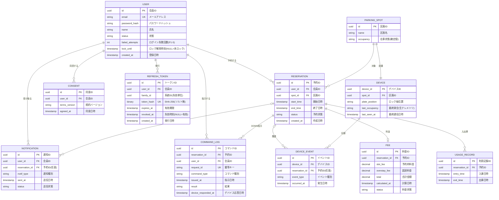

# 駐車場予約システム ER図 / テーブル定義

要件定義 v5 の §7 データモデルを ER 図に落とし込み、各カラムに論理名（日本語名）を併記したものです。mermaid 対応ビューア（GitHub・VS Code・Obsidian など）では下の図がそのまま描画されます。

> 改訂：デバイスイベント／通知と予約のカーディナリティを「0または1」に修正、`NOTIFICATION.reservation_id`（任意）を追加、在車状態の source of truth・認証トークン格納先・論理状態の導出方針を設計メモに明記。

## ER図（mermaid）

---

## テーブル定義（論理名／物理名）

凡例：PK = 主キー、FK = 外部キー、UK = 一意キー

### 会員（USER）

| 論理名 | 物理名 | 型 | キー | 備考・取りうる値 |
| --- | --- | --- | --- | --- |
| 会員ID | id | uuid | PK | |
| メールアドレス | email | string | UK | ログインID |
| パスワードハッシュ | password_hash | string | | 平文保存不可 |
| 氏名 | name | string | | |
| 状態 | status | string | | `active` / `withdrawn` |
| ログイン失敗回数 | failed_attempts | int | | F1-5 アカウントロック。MVP は User 列で保持（認証設計§6） |
| ロック解除時刻 | lock_until | timestamp | | NULL=未ロック。UTC |
| 登録日時 | created_at | timestamp | | |

> ポイントは Phase 2 のため MVP では列を持たない。failed_attempts / lock_until はブルートフォース対策（F1-5）。キャッシュ運用や専用テーブルに移す場合は本2列を廃する。

### リフレッシュトークン（REFRESH_TOKEN）

自前 JWT 認証（認証設計§7）。提示トークンの SHA-256（ソルト無）を `token_hash` に保存し、等値照合＋ローテーション、`family_id` 単位で系統失効。

| 論理名 | 物理名 | 型 | キー | 備考 |
| --- | --- | --- | --- | --- |
| トークンID | id | uuid | PK | |
| 会員ID | user_id | uuid | FK | |
| 系統ID | family_id | uuid | | ログインで採番、ローテーションで引継ぎ（失効単位） |
| トークンハッシュ | token_hash | binary | UK | 平文の SHA-256（ソルト無・決定的）。VARBINARY(32) |
| 有効期限 | expires_at | timestamp | | UTC |
| 失効時刻 | revoked_at | timestamp | | NULL=有効 |
| 発行日時 | created_at | timestamp | | |

> 期限切れ・失効済み行はタイマー Functions `cleanupTokens` で定期削除。

### 同意記録（CONSENT）

| 論理名 | 物理名 | 型 | キー | 備考 |
| --- | --- | --- | --- | --- |
| 同意ID | id | uuid | PK | |
| 会員ID | user_id | uuid | FK | |
| 規約バージョン | terms_version | string | | 同意した規約・ポリシーの版 |
| 同意日時 | agreed_at | timestamp | | |

### 駐車区画（PARKING_SPOT）

| 論理名 | 物理名 | 型 | キー | 備考・取りうる値 |
| --- | --- | --- | --- | --- |
| 区画ID | id | uuid | PK | |
| 区画名 | name | string | | 区画名・番号 |
| 在車状態（確定値） | occupancy | string | | `occupied` / `vacant`。アプリが参照する確定値 |

### AUTOSTAND（DEVICE）

| 論理名 | 物理名 | 型 | キー | 備考・取りうる値 |
| --- | --- | --- | --- | --- |
| デバイスID | device_id | uuid | PK | |
| 区画ID | spot_id | uuid | FK | 区画と 1:1 |
| ロック板位置 | plate_position | string | | `up` / `down` |
| 最終満空（生テレメトリ） | last_occupancy | string | | デバイスから来た生の値 |
| 最終通信日時 | last_seen_at | timestamp | | デバイス健全性判定に使用（§8） |

### 予約（RESERVATION）

| 論理名 | 物理名 | 型 | キー | 備考・取りうる値 |
| --- | --- | --- | --- | --- |
| 予約ID | id | uuid | PK | |
| 会員ID | user_id | uuid | FK | |
| 区画ID | spot_id | uuid | FK | |
| 開始日時 | start_time | timestamp | | UTC |
| 終了日時 | end_time | timestamp | | UTC |
| 予約状態 | status | string | | `reserved` / `active` / `completed` / `cancelled` / `no_show` / `overstay` |
| 作成日時 | created_at | timestamp | | |

### 利用記録（USAGE_RECORD）

| 論理名 | 物理名 | 型 | キー | 備考 |
| --- | --- | --- | --- | --- |
| 利用記録ID | id | uuid | PK | |
| 予約ID | reservation_id | uuid | FK | |
| 入庫日時 | entry_time | timestamp | | |
| 出庫日時 | exit_time | timestamp | | |

> 期間内の複数回入出庫を記録。ノーショー判定（入庫記録の有無）にも用いる。

### 料金（FEE）

| 論理名 | 物理名 | 型 | キー | 備考 |
| --- | --- | --- | --- | --- |
| 料金ID | id | uuid | PK | |
| 予約ID | reservation_id | uuid | FK | |
| 予約枠料金 | slot_fee | decimal | | 予約時間 × 単価 |
| 超過料金 | overstay_fee | decimal | | 実時間ベース |
| 合計金額 | total | decimal | | |
| 計算日時 | calculated_at | timestamp | | |
| 料金状態 | status | string | | 未計算 / 確定 など |

### コマンドログ（COMMAND_LOG）

| 論理名 | 物理名 | 型 | キー | 備考・取りうる値 |
| --- | --- | --- | --- | --- |
| コマンドID | id | uuid | PK | |
| 予約ID | reservation_id | uuid | FK | |
| 会員ID | user_id | uuid | FK | |
| 冪等キー | request_id | string | UK | 重複 DOWN 指示の吸収 |
| コマンド種別 | command_type | string | | `DOWN` |
| 指示日時 | issued_at | timestamp | | 入庫待ちタイムアウトの基準時刻 |
| 結果 | result | string | | `pending` / `success` / `failure`（受信時 pending → 結果で更新。DDL `CK_Cmd_result` と一致） |
| デバイス応答日時 | device_responded_at | timestamp | | |

### デバイスイベント（DEVICE_EVENT）

| 論理名 | 物理名 | 型 | キー | 備考・取りうる値 |
| --- | --- | --- | --- | --- |
| イベントID | id | uuid | PK | |
| デバイスID | device_id | uuid | FK | |
| 予約ID | reservation_id | uuid | FK | 任意（予約に紐づかないイベントもある） |
| イベント種別 | event_type | string | | `down_exec` / `up` / `entry` / `exit` |
| 発生日時 | occurred_at | timestamp | | |

### 通知ログ（NOTIFICATION）

| 論理名 | 物理名 | 型 | キー | 備考 |
| --- | --- | --- | --- | --- |
| 通知ID | id | uuid | PK | |
| 会員ID | user_id | uuid | FK | |
| 予約ID | reservation_id | uuid | FK | 任意（アカウント系通知は紐づかない） |
| 通知種別 | notif_type | string | | |
| 送信日時 | sent_at | timestamp | | |
| 送信状態 | status | string | | |

---

## リレーション

| 関連 | カーディナリティ | 意味 |
| --- | --- | --- |
| 会員 → 予約 | 1 : 多 | 1人が複数の予約を持つ |
| 会員 → 同意記録 | 1 : 多 | |
| 会員 → コマンドログ | 1 : 多 | DOWN 指示の操作者 |
| 会員 → 通知ログ | 1 : 多 | 通知の受信者 |
| 会員 → リフレッシュトークン | 1 : 多 | 自前 JWT のローテーション・系統失効 |
| 駐車区画 → AUTOSTAND | 1 : 1 | 区画にデバイス1台（MVP前提） |
| 駐車区画 → 予約 | 1 : 多 | 区画ごとの予約 |
| 予約 → 利用記録 | 1 : 多 | 期間内の複数回入出庫 |
| 予約 → 料金 | 1 : 0..1 | 料金は計算後に確定 |
| 予約 → コマンドログ | 1 : 多 | DOWN 指示 |
| 予約 → デバイスイベント | 0..1 : 多 | イベントは予約に紐づかない場合あり |
| 予約 → 通知ログ | 0..1 : 多 | 通知は予約に紐づかない場合あり（アカウント系） |
| AUTOSTAND → デバイスイベント | 1 : 多 | 状態遷移記録 |

---

## 設計メモ

- 区画とデバイスは 1:1。FK は `DEVICE.spot_id` に集約し、`PARKING_SPOT.device_id` は冗長のため持たない。設置前・故障交換中にデバイス未割当を許す場合は `||--o|`（区画は 0..1 台）に緩和する。
- 在車状態の source of truth：`DEVICE.last_occupancy` はデバイスからの生テレメトリ、`PARKING_SPOT.occupancy` はアプリが参照する確定値とする。Functions がテレメトリ受信時に後者を更新する。
- `COMMAND_LOG.request_id` を一意キーにし、DOWN 指示の冪等性（要件 F4-7）をスキーマで担保する。
- 認証は自前 JWT に確定（§12 #6）。リフレッシュトークン管理として `REFRESH_TOKEN` テーブルを追加済み（token_hash 等値照合＋ローテーション＋family_id 系統失効）。MVP は access の denylist を持たない方針のため失効用 denylist テーブルは不要。Entra External ID に倒す場合は外部管理で本テーブルは不要。
- §5 の論理状態（ブロック中／予約待機／入庫待ち／在車中／超過中）は列として持たず、予約状態＋ロック板位置＋在車状態＋最新の未完了 DOWN（`COMMAND_LOG.issued_at`）から導出する。入庫待ちのタイムアウト判定のため「予約ごとの未完了 DOWN を引ける」索引・クエリを用意する。
- `DEVICE.last_seen_at` をデバイス健全性の判定（予約可能性・満空表示、要件 §8）に使用する。
- 日時はすべて UTC で保存し、表示時に JST へ変換する。
- 論理名は設計上の表示名であり、物理名（英字）が実 DB の識別子となる。

---

## 詳細設計メモ（記録のみ）

- 競合チェック（§4.3.2）と availability は `RESERVATION(spot_id, start_time, end_time, status)` を範囲検索するため複合索引が必要。serializable トランザクションの効きにも関わる。
- `uuid` 主キーを Azure SQL でクラスタ化キーにすると、ランダム GUID により断片化しやすい。`NEWSEQUENTIALID()` 相当の連番 GUID か、クラスタ化キーを別に持つ構成を検討する。
- アカウントロック（F1-5）の失敗回数・ロック期限は **MVP では `[User].failed_attempts` / `lock_until` 列で保持**（実装済み）。キャッシュ運用や専用テーブルへ移す場合は本2列を廃して別管理に切り替える（認証設計§6）。
- enum 相当の取りうる値は、アプリ／DB のいずれで制約するか（CHECK 制約・参照テーブル・アプリ層バリデーション）を詳細設計で確定する。