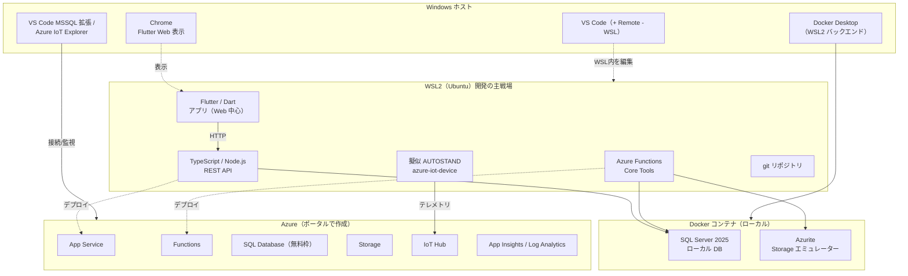

# 駐車場予約システム 環境構築手順書（WSL2 + Docker / Azure ポータル版）

| 項目 | 内容 |
| --- | --- |
| 対象システム | 駐車場予約システム（仮） |
| 技術スタック | Flutter / Dart ＋ TypeScript（Node.js）＋ Azure 一式 |
| ローカル開発方針 | **Windows + WSL2(Ubuntu) + Docker Desktop** で開発する |
| Azure 操作方針 | **基本は Azure ポータル（GUI）** で操作する。補助 GUI ツールも併用 |
| 本書の目的 | ローカル開発環境の構築と Azure リソースの初期作成を、順番どおりに完了できるようにする |
| 前提 | 要件定義書のレビューは未完了。技術スタックは確定済みのため、構成に依存しない範囲を先行構築する |

> **このバージョンで作るもの**
> 「WSL2 + Docker でローカル開発できる状態」と「Azure 上に無料枠リソース一式が揃った状態」までがゴールです。アプリのロジック実装は範囲外です。
>
> **基本の考え方（無料枠節約）**
> 日々の開発は **Docker コンテナのローカル DB / Storage エミュレーター** で完結させ、Azure の無料枠は「クラウド統合テスト」と「デプロイ先」としてだけ使います。これにより Azure SQL の無料枠（vCore 秒）を温存できます。

---

## 目次

1. [全体像（どこで何を動かすか）](#1-全体像どこで何を動かすか)
2. [事前準備（アカウント類）](#2-事前準備アカウント類)
3. [課金保護（Budget・最初に必ず設定）](#3-課金保護budget最初に必ず設定)
4. [ローカル開発環境の構築（WSL2 + Docker Desktop）](#4-ローカル開発環境の構築wsl2--docker-desktop)
5. [リポジトリ構成の作成（WSL2 内）](#5-リポジトリ構成の作成wsl2-内)
6. [ローカル Docker サービスの起動（SQL / Storage）](#6-ローカル-docker-サービスの起動sql--storage)
7. [Azure リソースの作成（ポータル/GUI）](#7-azure-リソースの作成ポータルgui)
8. [設定・接続情報の管理](#8-設定接続情報の管理)
9. [動作確認（スモークテスト）](#9-動作確認スモークテスト)
10. [無料枠を守る運用Tips](#10-無料枠を守る運用tips)
11. [完了チェックリスト](#11-完了チェックリスト)
12. [トラブルシューティング](#12-トラブルシューティング)
13. [付録：バージョン早見表](#13-付録バージョン早見表)

---

## 1. 全体像（どこで何を動かすか）

今回の構成は「Windows ホスト」「WSL2(Ubuntu)」「Docker コンテナ」「Azure（クラウド）」の4つに役割が分かれます。**どのツールがどこで動くか** を最初に押さえると迷いません。



| 場所 | 何を動かすか | ポイント |
| --- | --- | --- |
| **Windows ホスト** | VS Code 本体 / Chrome（Flutter Web 表示）/ Docker Desktop 本体 / Azure 用 GUI ツール | GUI が必要なものはここ |
| **WSL2(Ubuntu)** | Flutter（Web 中心）・バックエンド・Functions・擬似デバイス・git リポジトリ・各種 CLI | コードと Linux ツールはここ（開発の主戦場） |
| **Docker コンテナ** | ローカル SQL（SQL Server 2025）・Azurite（Storage エミュレーター） | 日々の開発はここに接続し Azure 無料枠を温存 |
| **Azure（ポータル）** | App Service / Functions / SQL / Storage / IoT Hub / 監視 | クラウド統合テストとデプロイ先。IoT Hub だけはローカル代替が無いため最初から実物を使う |

> **Flutter の置き場所に関する方針（重要・本環境固有の判断）**
> 本環境では Windows 側のセキュリティソフト（Sophos Intercept X・集中管理）が Flutter の pub キャッシュ更新をブロックするため、**Flutter は WSL2(Ubuntu) 側にインストールし、Web（Chrome）ターゲットで開発** します。Web 開発は WSL2 で問題なく動き、画面・API 連携・ロジックの大半をここで作り込めます。
>
> **Android 実機・エミュレーターは当面見送り**ます。Android を WSL2 で動かすのは USB パススルー（usbipd-win）や入れ子仮想化が必要で現実的でないため、必要になった段階で **IT 部門に Sophos の除外（Flutter SDK と pub キャッシュのフォルダ）を依頼し、Windows 側に Flutter を入れ直して** 対応します（手順は [4-7](#4-7-flutterwsl2-内web-中心) の補足を参照）。

---

## 2. 事前準備（アカウント類）

| アカウント | 用途 | 取得先 |
| --- | --- | --- |
| Microsoft アカウント | Azure サインインに必要 | `https://account.microsoft.com/` |
| Azure サブスクリプション | Azure リソースの作成先。新規なら「Azure 無料アカウント」推奨 | `https://azure.microsoft.com/free/` |
| GitHub アカウント（任意） | ソース管理・将来の CI/CD | `https://github.com/` |
| Docker アカウント（任意） | Docker Desktop のサインイン（無料） | `https://www.docker.com/` |

> Azure SQL Database の無料オファーは無料アカウントでなくても使えますが、無料アカウントなら他サービスの無料枠も付くため学習目的では推奨です。

---

## 3. 課金保護（Budget・最初に必ず設定）

無料枠プロジェクトで最重要の作業です。**Azure リソースを1つも作る前に** ここを設定します。

### 3-1. 予算（Budget）とアラートの設定

1. Azure ポータル（`https://portal.azure.com/`）にサインイン。
2. 上部検索で **「コストの管理と請求（Cost Management + Billing）」** を開く。
3. 左メニュー **「コスト管理」→「予算（Budgets）」→「＋ 追加」**。
4. 次のとおり設定。

   | 設定項目 | 推奨値 |
   | --- | --- |
   | 予算の範囲 | 利用するサブスクリプション |
   | 予算額 | `1000`（円。学習用なら少額に） |
   | リセット期間 | 月次 |
   | アラートのしきい値 | 実績の 50% / 80% / 100% |
   | 通知メール | 自分のメールアドレス |

> Budget は「通知」であり「自動停止」ではありません。本書のように **ローカル開発を Docker で完結** させ、Azure 側は使う時だけ触る運用にすると、そもそも無料枠の消費を最小化できます。

### 3-2. リージョンと命名規則を先に決める

| 決めること | 本書の推奨 | 理由 |
| --- | --- | --- |
| リージョン | `Japan East`（東日本） | 低遅延。**全リソースを同一リージョンに統一**（SQL 無料オファーはサブスクリプション単位でリージョンが固定されるため特に重要） |
| 環境サフィックス | `dev` / `prod` | 要件定義 6.5「環境ごとに設定を分離」に対応 |
| 命名規則 | `<種別略称>-parking-<環境>` | 例：`rg-parking-dev`, `app-parking-api-dev` |

**命名例（dev 環境）**

| リソース | 名前の例 | 備考 |
| --- | --- | --- |
| リソースグループ | `rg-parking-dev` | |
| App Service プラン | `asp-parking-dev` | |
| Web アプリ（API） | `app-parking-api-dev` | グローバル一意。重複時は末尾に数字 |
| Functions | `func-parking-dev` | グローバル一意 |
| SQL サーバー | `sql-parking-dev` | グローバル一意 |
| SQL データベース | `sqldb-parking` | |
| ストレージ | `stparkingdev001` | 英小文字＋数字のみ・3〜24文字・グローバル一意 |
| IoT Hub | `iot-parking-dev` | グローバル一意 |
| Log Analytics | `log-parking-dev` | |
| Application Insights | `appi-parking-dev` | |

---

## 4. ローカル開発環境の構築（WSL2 + Docker Desktop）

> 以降、コマンドの実行場所を **【Windows PowerShell（管理者）】** か **【WSL2 / Ubuntu ターミナル】** で明示します。間違えないよう注意してください。

### 4-1. WSL2 と Ubuntu の導入

WSL2（Windows Subsystem for Linux 2）を有効化して Ubuntu を入れます。

**【Windows PowerShell（管理者）】**

```powershell
# WSL2 と既定の Ubuntu をまとめて導入
wsl --install

# 既存環境の場合は最新化と既定バージョン設定
wsl --update
wsl --set-default-version 2
```

- 実行後 **PC を再起動** します。
- 再起動後、自動的に Ubuntu のセットアップが始まるので、**Linux 用のユーザー名とパスワード** を設定します（Windows のものとは別で構いません）。
- 確認：

  **【Windows PowerShell】**
  ```powershell
  wsl -l -v        # Ubuntu が VERSION 2 で表示されればOK
  ```

> Ubuntu を起動するには、スタートメニューの「Ubuntu」か、Windows Terminal の下矢印から「Ubuntu」を選びます。以降「WSL2 ターミナル」と書いたらこれを指します。

導入直後にパッケージを最新化しておきます。

**【WSL2 / Ubuntu ターミナル】**
```bash
sudo apt update && sudo apt upgrade -y
```

### 4-2. Docker Desktop の導入と WSL2 連携

**【Windows PowerShell】**

```powershell
winget install -e --id Docker.DockerDesktop
```

導入後、Docker Desktop を起動し、設定を確認します。

1. Docker Desktop → **Settings → General** → **「Use the WSL 2 based engine」** が ON になっていること。
2. **Settings → Resources → WSL Integration** → **「Enable integration with my default WSL distro」** を ON、さらに **Ubuntu** のトグルも ON にする。
3. **Apply & Restart**。

確認：

**【WSL2 / Ubuntu ターミナル】**
```bash
docker --version
docker compose version
docker run --rm hello-world   # "Hello from Docker!" が出ればOK
```

> Docker は Windows 側の Docker Desktop が実体で、WSL2 からはその機能を利用します。WSL2 内に別途 Docker Engine を入れる必要はありません。

### 4-3. VS Code（Windows）＋ Remote - WSL

VS Code は **Windows 側にインストール** し、拡張機能経由で WSL2 内を編集します。

**【Windows PowerShell】**
```powershell
winget install -e --id Microsoft.VisualStudioCode
```

VS Code に以下の拡張機能を入れます（拡張機能パネルで検索）。

| 拡張機能 | 用途 |
| --- | --- |
| **WSL**（Remote - WSL） | WSL2 内のフォルダを VS Code で開く（必須） |
| Dev Containers（任意） | コンテナ内開発を行う場合 |
| Docker / Container Tools | コンテナ・イメージの GUI 操作 |
| Dart, Flutter | Flutter 開発 |
| ESLint, Prettier | TypeScript の解析・整形 |
| Azure Functions | Functions のローカル開発・デプロイ |
| Azure Resources | Azure リソースの一覧・操作 |
| Azure Databases | SQL への接続・クエリ |

WSL2 のフォルダを開く方法：WSL2 ターミナルでプロジェクトフォルダに移動し `code .` を実行（初回は VS Code Server が自動導入される）。ウィンドウ左下に「WSL: Ubuntu」と表示されれば WSL2 に接続できています。

### 4-4. 共通ツール：Git（WSL2 内）

**【WSL2 / Ubuntu ターミナル】**
```bash
sudo apt install -y git
git --version
git config --global user.name "あなたの名前"
git config --global user.email "you@example.com"
```

### 4-5. バックエンド：Node.js（LTS）＋ TypeScript（WSL2 内）

バージョン管理ツール **fnm** 経由で **Node.js 24 LTS** を入れます。

**【WSL2 / Ubuntu ターミナル】**
```bash
# fnm を導入
curl -fsSL https://fnm.vercel.app/install | bash
# 案内に従いシェル設定を反映（例）
source ~/.bashrc

# Node.js 24 LTS を導入して既定化
fnm install 24
fnm use 24
fnm default 24

# 確認
node -v   # v24.x.x
npm -v
```

TypeScript ツール（任意でグローバル導入）：

```bash
npm install -g typescript ts-node
tsc -v
```

### 4-6. Azure Functions Core Tools（v4・WSL2 内）

Functions をローカルで実行するために導入します。**WSL2(Ubuntu) では apt（Microsoft 公式リポジトリ）での導入を推奨** します。

> **npm でのグローバル導入は避ける**
> `npm install -g azure-functions-core-tools@4` は、インストール時に本体バイナリを別途ダウンロードする仕組みのため、WSL2 では失敗して `func` 実行時に `bin/func ENOENT` になることがあります。また fnm 配下に入ると Node バージョンを切り替えるたびに消えます。apt 版はシステム側に入るため、これらの問題を回避できます。

**【WSL2 / Ubuntu ターミナル】**
```bash
sudo apt-get update
sudo apt-get install -y curl gpg lsb-release

# Microsoft リポジトリ設定（Ubuntu のバージョンに自動対応）
curl -sSL -O https://packages.microsoft.com/config/ubuntu/$(lsb_release -rs)/packages-microsoft-prod.deb
sudo dpkg -i packages-microsoft-prod.deb
rm packages-microsoft-prod.deb

sudo apt-get update
sudo apt-get install -y azure-functions-core-tools-4

# 確認
which func        # /usr/bin/func を指していればOK
func --version    # 4.x が出ればOK
```

> もし以前 npm 版を入れていた場合は、先に `npm uninstall -g azure-functions-core-tools` で削除し、`hash -r` でシェルのコマンド位置キャッシュをクリアしてから確認してください（古い `func` のパスを覚えたままだと同じエラーが続きます）。

### 4-7. Flutter（WSL2 内・Web 中心）

本環境では Windows 側のセキュリティソフト（Sophos 等）が Flutter の pub キャッシュ更新を妨げるため、**Flutter は WSL2(Ubuntu) 側にインストールし、Web（Chrome）ターゲットで開発** します。

**【WSL2 / Ubuntu ターミナル】**
```bash
# 必要な依存パッケージ
sudo apt-get update
sudo apt-get install -y curl git unzip xz-utils zip libglu1-mesa

# Flutter SDK を stable で取得（ホーム配下に展開）
cd ~ && git clone https://github.com/flutter/flutter.git -b stable

# PATH を通す
echo 'export PATH="$HOME/flutter/bin:$PATH"' >> ~/.bashrc
source ~/.bashrc

# Web を有効化して状態確認
flutter config --enable-web
which flutter        # /home/<user>/flutter/bin/flutter を指していればOK
flutter --version    # 安定版（例：3.44.x / Dart 3.x）
flutter doctor
```

`flutter doctor` では **Android toolchain / Android Studio に×が付きますが、Web のみ使う本構成では無視して構いません**。同様に **Linux toolchain（clang/CMake/ninja/pkg-config）の×も、Linux デスクトップ向けビルド用なので Web では無視可** です。

> **Chrome に×（`Cannot find Chrome executable`）が出る場合**
> WSL2 内に Chrome が無いと `-d chrome` は使えません。次のどちらかで対応します。
>
> **方法A（推奨・追加インストール不要）**：web-server で動かし、Windows 側のブラウザで開く。
> ```bash
> flutter run -d web-server --web-port 5000
> # 表示された http://localhost:5000 を Windows の Chrome / Edge で開く（コード変更後は R でホットリスタート）
> ```
>
> **方法B（`-d chrome` を使いたい場合）**：WSL2 に Chrome を入れる。
> ```bash
> cd /tmp
> wget https://dl.google.com/linux/direct/google-chrome-stable_current_amd64.deb
> sudo apt install -y ./google-chrome-stable_current_amd64.deb
> echo 'export CHROME_EXECUTABLE=/usr/bin/google-chrome' >> ~/.bashrc
> source ~/.bashrc
> flutter doctor   # Chrome に✓
> ```

> **Windows 側に Flutter を入れていた場合**
> WSL2 側と二重認識して混乱するため、Windows 側の Flutter は削除を推奨します。Windows PowerShell で `(Get-Command flutter).Source` でパスを確認 →（VS Code 等を閉じて）SDK フォルダを `Remove-Item -Recurse -Force` で削除 → 環境変数 `Path` から `...\flutter\bin` を除去。WSL2 側の `flutter` には影響しません。

**バックエンドに接続する際の URL**

Flutter（WSL2）もバックエンド（WSL2）も同じ Linux 内で動くため、接続先はシンプルです。

| Flutter 実行ターゲット | API_BASE_URL の例 | 備考 |
| --- | --- | --- |
| Chrome（`flutter run -d chrome`） | `http://localhost:3000` | 本構成の基本。WSL2 内で完結 |
| Web サーバー（`flutter run -d web-server`） | `http://localhost:3000` | Windows 側ブラウザから開く場合に使用 |

> CORS が必要になったら、バックエンド側で Flutter の起動オリジンを許可します。

**（将来）Android 実機・エミュレーターを使う段階になったら**

Android は WSL2 では現実的でないため、その時点で次の対応を行います。

1. IT 部門に **Sophos の除外**（Flutter SDK フォルダと `%LOCALAPPDATA%\Pub\Cache`）を依頼。
2. Windows 側に Flutter を入れ直す（公式手動インストール、または VS Code 拡張の「Download SDK」。`C:\dev\flutter` のような空白・日本語を含まないパスへ）。
3. Android Studio（`winget install --id Google.AndroidStudio -e`）を導入し、`flutter doctor --android-licenses` で同意。
4. その場合の接続 URL は、エミュレーター＝`http://10.0.2.2:3000`、実機＝`http://<PCのLAN IP>:3000`、バックエンドは WSL2 内で `0.0.0.0` にバインド。

> Flutter は winget では配布されていません（`Google.Flutter` は存在しない）。Windows 側に入れ直す際は公式手動インストールか VS Code 拡張を使ってください。

### 4-8. Azure 用 GUI ツール（ポータルの補助）

Azure をポータル中心で扱う方針に合わせ、操作を補助するツールを入れます。

**SQL ツール：VS Code の MSSQL 拡張機能**（Azure Data Studio は 2026/2/28 でサポート終了したため、その後継を使う）

VS Code の拡張機能パネルで **「SQL Server (mssql)」**（発行元 Microsoft）を検索して導入します。WSL 接続中は **「Install in WSL: Ubuntu」** を選びます。コマンドでも導入可：

```bash
code --install-extension ms-mssql.mssql
```

接続手順：左のアクティビティバーの SQL Server アイコン（円柱）→ **Add Connection**（または Ctrl+Shift+P →「MS SQL: Connect」）。Server name にローカルは `localhost,1433`、Azure は `sql-parking-dev.database.windows.net` を指定し、SQL Login／ユーザー `sa`（Azure は作成した管理者）／パスワード、Trust server certificate を Yes にして接続します。

**IoT ツール：Azure IoT Explorer（GUI）**

IoT Hub のテレメトリ確認・ダイレクトメソッド送信・デバイス登録を GUI で行えます。

**【Windows PowerShell】**
```powershell
winget install --id Microsoft.Azure.IoTExplorer -e
```

> winget で見つからない場合は、GitHub リリース（`https://github.com/Azure/azure-iot-explorer/releases`）から OS 別インストーラーを入手できます。

| ツール | 役割 |
| --- | --- |
| **VS Code MSSQL 拡張** | ローカル Docker DB と Azure SQL の両方に VS Code から接続してクエリ |
| **Azure IoT Explorer** | IoT Hub に GUI 接続。テレメトリの受信確認、ダイレクトメソッド送信、デバイス登録ができる |

### 4-9. Azure CLI（任意）

ポータル中心で進めるため必須ではありません。コマンドで一括処理したくなったら導入してください。

**【WSL2 / Ubuntu ターミナル】**
```bash
curl -sL https://aka.ms/InstallAzureCLIDeb | sudo bash
az login
```

---

## 5. リポジトリ構成の作成（WSL2 内）

> **重要**：リポジトリは **WSL2 の Linux ホーム配下（例：`~/projects`）** に置きます。`/mnt/c/...`（Windows 側ディスク）に置くとファイル I/O が遅く、`flutter`/`npm` が極端に遅くなります。

### 5-1. ルートフォルダとフォルダ構成

**【WSL2 / Ubuntu ターミナル】**
```bash
mkdir -p ~/projects && cd ~/projects
mkdir parking-reservation && cd parking-reservation
git init
code .   # VS Code が WSL 接続で開く
```

推奨フォルダ構成：

```
parking-reservation/
├── README.md
├── .gitignore
├── docker-compose.yml     ← ローカル SQL / Azurite を起動
├── docs/                  ← 要件定義書など
├── backend/               ← TypeScript REST API（App Service にデプロイ）
├── functions/             ← Azure Functions（イベント処理）
├── device-sim/            ← 擬似 AUTOSTAND（azure-iot-device / Node.js）
└── mobile/                ← Flutter アプリ（Web 中心）
```

> 本構成では `mobile`（Flutter）も WSL2 内で扱い、Web（Chrome / web-server）で開発します。Android 実機・エミュレーターが必要になった段階で Windows 側に移す方針です（[4-7](#4-7-flutterwsl2-内web-中心) 参照）。

### 5-2. 各プロジェクトの初期化

> 「空の雛形」だけ作ります。実装は範囲外です。**いずれも WSL2 ターミナルで、リポジトリのルート（`~/projects/parking-reservation`）から実行**します。
> **注意**：`npm init` / `tsc --init` などは各プロジェクトの**直下**（例：`backend/`）で実行します。`mkdir src` は「空の `src` フォルダを用意するだけ」で、`cd src` して中で初期化しないこと（`package.json` 等が `src` の中に入ってしまいます）。

**バックエンド（TypeScript）**
```bash
mkdir backend && cd backend
npm init -y
npm install express
npm install -D typescript @types/node @types/express ts-node nodemon
npx tsc --init
mkdir src          # 空フォルダを作るだけ。cd src はしない
cd ..
```

**Azure Functions（TypeScript）**
```bash
mkdir functions && cd functions
func init --worker-runtime node --language typescript
func new --name healthCheck --template "HTTP trigger" --authlevel anonymous
cd ..
```

**擬似 AUTOSTAND デバイス（Node.js）**
```bash
mkdir device-sim && cd device-sim
npm init -y
npm install azure-iot-device azure-iot-device-mqtt
mkdir src
cd ..
```

**Flutter アプリ（WSL2 内・Web 中心）**

`flutter run` は「プロジェクトを作成したあと、その中に入ってから」実行します。次の順番で行ってください。

1. プロジェクトを作成する（`mobile` というフォルダ＝プロジェクト名が作られ、その直下に一式が展開される）。
   ```bash
   flutter create mobile
   # Web だけにしたい場合は: flutter create --platforms web mobile
   ```
2. 作成したプロジェクトの中に入る。
   ```bash
   cd mobile
   ```
3. 起動して動作確認する（この `run` は手順1・2のあとに実行する確認ステップ。表示された URL を Windows のブラウザで開く）。
   ```bash
   flutter run -d web-server --web-port 5000
   ```
4. 確認できたらリポジトリのルートに戻る。
   ```bash
   cd ..
   ```

> `flutter run` はプロジェクト作成前には実行できません（`pubspec.yaml` がある場所でのみ動作）。手順3は「初期画面が出るかの確認」なので、雛形作成だけ済ませて先に進みたい場合はスキップしても構いません。

### 5-3. .gitignore の作成

ルートに `.gitignore` を作成します。

```gitignore
# Node
node_modules/
dist/
*.log

# 環境変数・秘密情報（絶対にコミットしない）
.env
.env.*
functions/local.settings.json

# Flutter
mobile/.dart_tool/
mobile/build/
mobile/.flutter-plugins*

# Docker のローカルデータ（任意。ボリュームで持つ場合は不要）
.docker-data/

# その他
.DS_Store
```

> 接続文字列やパスワードを含むファイル（`.env`, `local.settings.json`）は必ず除外。要件定義 6.1 のセキュリティ方針に直結します。

---

## 6. ローカル Docker サービスの起動（SQL / Storage）

日々の開発で使うローカル DB（SQL Server 2025）と Storage エミュレーター（Azurite）を Docker で立てます。Azure の無料枠を消費しません。

### 6-1. docker-compose.yml の作成

ルートに `docker-compose.yml` を作成します（パスワードは強固なものに置き換え）。

```yaml
services:
  sql:
    image: mcr.microsoft.com/mssql/server:2025-latest
    container_name: parking-sql
    environment:
      ACCEPT_EULA: "Y"
      MSSQL_SA_PASSWORD: "Your_Strong_Passw0rd!"   # 8文字以上・英大小+数字+記号
    ports:
      - "1433:1433"
    volumes:
      - sqldata:/var/opt/mssql

  azurite:
    image: mcr.microsoft.com/azure-storage/azurite
    container_name: parking-azurite
    ports:
      - "10000:10000"   # Blob
      - "10001:10001"   # Queue
      - "10002:10002"   # Table
    volumes:
      - azuritedata:/data

volumes:
  sqldata:
  azuritedata:
```

> SQL Server コンテナは **2GB 以上の RAM** を使います。Docker Desktop の Resources で WSL2 に十分なメモリ（4GB 以上推奨）が割り当てられているか確認してください。

### 6-2. 起動と確認

**【WSL2 / Ubuntu ターミナル】**
```bash
cd ~/projects/parking-reservation
docker compose up -d        # バックグラウンド起動
docker compose ps           # State が running か確認
docker compose logs sql     # SQL の起動ログ（初回は数十秒）
```

停止・後片付けは次のとおり。

```bash
docker compose stop         # 一時停止（データは残る）
docker compose down         # 停止＋コンテナ削除（volume のデータは残る）
docker compose down -v      # データごと完全削除
```

### 6-3. ローカル SQL に接続する

VS Code の **MSSQL 拡張**（4-8）で新規接続します。SQL Server アイコン → Add Connection で以下を入力：

| 項目 | 値 |
| --- | --- |
| Server name | `localhost,1433` |
| Authentication Type | SQL Login |
| User name | `sa` |
| Password | docker-compose で設定した値 |
| Trust server certificate | Yes（ローカルの自己署名証明書のため） |

接続後、開発用 DB を作成しておきます。

```sql
CREATE DATABASE parking;
```

---

## 7. Azure リソースの作成（ポータル/GUI）

ここから Azure 上にリソースを作ります。**第3章の課金保護を済ませてから** 着手してください。すべて **ポータル（GUI）** の操作で進めます。

> リソースは作るたびに、最初に作る **リソースグループ `rg-parking-dev`** と **リージョン `Japan East`** を選びます。

### 7-1. リソースグループ

1. ポータル上部の検索で **「リソース グループ」** → **「＋ 作成」**。
2. サブスクリプション選択、名前 `rg-parking-dev`、リージョン `Japan East` → **「確認および作成」→「作成」**。

### 7-2. Azure SQL Database（無料オファー）

クラウド統合テスト用の DB。無料オファーで作ります。

1. ブラウザで `https://aka.ms/azuresqlhub` を開き、**「無料で試す（Start free）」** を選ぶ。
2. 作成画面で設定。
   - リソースグループ：`rg-parking-dev`
   - データベース名：`sqldb-parking`
   - サーバー：新規作成 → 名前 `sql-parking-dev`、リージョン `Japan East`、認証「SQL 認証」、管理者ユーザー名・強固なパスワードを設定
   - 上部の **「無料オファーを適用（Apply offer）」** バナーをクリック
   - **「無料制限到達時の動作」** で **「翌月まで自動的に一時停止」** を選ぶ（課金を確実に防ぐ）
3. 「ネットワーク」タブで、**「Azure サービスおよびリソースにこのサーバーへのアクセスを許可」** を有効化し、**「現在のクライアント IP アドレスを追加」** を実行。
4. **「確認および作成」→「作成」**。

> **作成済みの DB に後からファイアウォールを設定する場合**（作成時に「ネットワーク」タブで設定しなかったとき）
> DB の概要画面の上部ツールバー **「サーバー ファイアウォールの設定」** を開く（または概要のサーバー名 `sql-parking-dev` → 左メニュー「設定」→「ネットワーク」）。表示された画面で、パブリックネットワークアクセスを **「選択されたネットワーク」** にし、**「Azure サービス…へのアクセスを許可する」** をオン、**「クライアント IPv4 アドレスの追加」** で自分の IP を追加して **保存**。ファイアウォールは「データベース」ではなく「サーバー」単位の設定です。

> **注意**：無料オファーの DB は接続を開きっぱなしにすると自動一時停止が働かず無料枠を消費します。VS Code の MSSQL 拡張で確認したら接続を閉じてください。日常開発はローカル Docker の SQL を使い、Azure SQL は統合テスト時だけ使うのが安全です。

### 7-3. Storage アカウント（Blob）

1. 検索で **「ストレージ アカウント」** → **「＋ 作成」**。
2. 「基本」タブ：リソースグループ `rg-parking-dev`、名前 `stparkingdev001`（英小文字＋数字）、リージョン `Japan East`、**パフォーマンス＝Standard**、**冗長性＝LRS（ローカル冗長）**。
3. 他のタブ（詳細／ネットワーク／データ保護／暗号化／タグ）は基本そのままでよい。迷ったら次だけ確認：
   - 詳細：「階層型名前空間（Data Lake Gen2）」はオフのまま、アクセス層は「ホット」。
   - ネットワーク：学習用は「すべてのネットワークからのパブリックアクセスを有効にする」が簡単。
4. **「確認および作成」→「作成」**。

> 迷ったら「**Standard・LRS にして残りは既定**」でOK。冗長性は既定が GRS だと料金が約2倍になるため、LRS への変更だけ忘れないこと。

> 日常開発の Blob は Azurite（ローカル）で代替します。このストレージは Functions の実行用および統合テスト用です。

### 7-4. App Service（API ホスト・無料 F1）

1. 検索で **「App Service」** → **「＋ 作成」→「Web アプリ」**。
2. 設定。
   - リソースグループ `rg-parking-dev`、名前 `app-parking-api-dev`
   - 公開「コード」、ランタイムスタック **「Node 22 LTS」または「Node 24 LTS」**（一覧に出るもの）、OS「Linux」、リージョン `Japan East`
   - 価格プラン → **「F1（Free）」** を選択
3. 「監視とセキュリティ保護」タブの Application Insights は **「いいえ」のままでよい**。Linux＋Node の組み合わせでは「コードレス監視」が非対応のためグレーアウトして有効化できないが、これは想定どおり。監視は 7-7 で作る Application Insights を **SDK 方式（接続文字列をアプリ設定に登録）** で繋ぐ（8-2／8-6）。
4. **「確認および作成」→「作成」**。

> **作成時に「Operation cannot be completed without additional quota ... Current Limit (Total VMs): 0」が出る場合**
> サブスクリプションのそのリージョンの計算クォータが 0 で、プランを確保できない状態です（新規／無料系で起きやすい）。App Service は「将来のデプロイ先」で今は必須ではないため、**いったん飛ばして第5章・第6章のローカル開発を進めてよい**。今すぐ作るなら、(a) リージョンを変える（`Japan West` / `Southeast Asia` など。クォータはリージョン単位なので別リージョンなら通ることが多い。機能上は他リソースと別地域でも可）、(b) サブスクリプションの「使用量 + クォータ」から上限を 1 以上に申請、(c) 無料試用版だと (b) で上げられないことが多く、その場合は従量課金（PAYG）へ変換（無料枠内なら課金されない）。

1. 検索で **「関数アプリ（Function App）」** → **「＋ 作成」**。
2. ホスティングプランは **「フレックス従量課金（Flex Consumption）」** を選ぶ。これが現行の Linux ベース従量課金で、0 にスケール（呼ばれない時は待機課金なし）＋実行分のみ課金。Node/Linux と OS が揃う。（旧 Consumption に相当するのは「従量課金 (Windows)」。Functions Premium / App Service / Container Apps は最低1インスタンス常時稼働や容量課金なので無料運用には選ばない）
3. 設定。
   - リソースグループ `rg-parking-dev`、名前 `func-parking-dev`、リージョン `Japan East`
   - ランタイムスタック「Node.js」、バージョンは App Service と揃える（22 か 24）
   - ストレージは `stparkingdev001` を選択（または新規）
4. **「確認および作成」→「作成」**。

> **「無料試用版サブスクリプションは Flex 従量課金ではサポートされていません」と出る場合**
> 無料試用版（Free Trial）では Flex 従量課金が使えません。対処は2つ。
> - **手早く**：ホスティングプランを **「従量課金 (Windows)」**（旧 Consumption 相当）に変えて作成。0 スケール＋実行分課金の性質は同じで、Node 関数も Windows で動く。ただし前述の VM クォータ（7-4）で弾かれる場合は次へ。
> - **根本解決**：サブスクリプションを **従量課金（Pay-As-You-Go）へアップグレード**（ポータルの「サブスクリプション」→対象→「アップグレード」）。これは「課金される」という意味ではなく制限を外す手続きで、無料枠の範囲で使う限り料金は発生しない。Budget アラートはそのまま有効。
> - **別リージョンで作る**：VM クォータ（Total VMs: 0）で弾かれる場合、`Japan West` など別リージョンなら空きがあって作成できることが多い（クォータはリージョン単位）。その場合、Functions だけ他リソース（`Japan East`）と別地域になるが、機能上は問題なく接続できる（レイテンシがわずかに増える程度）。きれいに揃えたいなら後で PAYG 化して `Japan East` に作り直してもよい。
> - Functions は将来使う器なので、急がなければ一旦飛ばして第5章・第6章のローカル開発を先に進めてもよい。

### 7-6. IoT Hub（無料 F1）＋ デバイス登録

IoT Hub はローカル代替が無いため、最初から実物を使います。**無料 F1 はサブスクリプションに1つだけ**。

1. 検索で **「IoT Hub」** → **「＋ 作成」**。
2. リソースグループ `rg-parking-dev`、名前 `iot-parking-dev`、リージョン `Japan East`。
3. 「管理」タブの価格とスケールのティアで **「Free（F1）」** を選ぶ。
4. **「確認および作成」→「作成」**。

**擬似デバイスを登録**

1. 作成した IoT Hub を開く → 左メニュー **「デバイス（Devices）」** → **「＋ デバイスの追加」**。
2. デバイス ID `autostand-sim-001`、認証「対称キー」、自動生成キーのまま **「保存」**。
3. 登録したデバイスを開くと **「プライマリ接続文字列」** が表示される → 後で `device-sim/.env` に貼る。

> テレメトリの受信確認やダイレクトメソッドの送信は、Windows の **Azure IoT Explorer**（4-8 で導入）で GUI から行えます。IoT Hub の接続文字列（共有アクセスポリシー `iothubowner` など）を IoT Explorer に登録して接続します。

### 7-7. Log Analytics ＋ Application Insights（監視）

1. 先に **「Log Analytics ワークスペース」** を検索 → 「＋ 作成」→ `log-parking-dev` を `rg-parking-dev` / `Japan East` で作成。
2. 次に **「Application Insights」** を検索 → 「＋ 作成」→ `appi-parking-dev` を作成。**「ログ分析ワークスペース」欄で `log-parking-dev` を選ぶ**（ワークスペースベース）。
3. 作成後、Application Insights の「概要」にある **「接続文字列」** をメモ（次章でアプリに設定）。

> App Service 側では Application Insights を有効化していない（7-4 のとおり Linux＋Node はコードレス監視非対応）。ここで作った `appi-parking-dev` の接続文字列を、App Service / Functions のアプリケーション設定に `APPLICATIONINSIGHTS_CONNECTION_STRING` として登録し、アプリ側で SDK を初期化して接続する（8-2／8-6）。

---

## 8. 設定・接続情報の管理

開発時はローカル（Docker）に、クラウド統合時は Azure に向けられるよう、接続情報を環境ごとに分離します（要件定義 6.1・6.5）。

### 8-1. 取得しておく接続情報

| 情報 | 取得元 | 用途 |
| --- | --- | --- |
| ローカル SQL 接続情報 | docker-compose の設定値 | 開発時の DB 接続 |
| Azure SQL 接続文字列 | SQL DB → 設定 → 接続文字列 | 統合テスト時の DB 接続 |
| Azurite 接続文字列 | 既定の開発用エミュレーター文字列 | 開発時の Blob |
| Storage 接続文字列 | Storage → アクセスキー | 統合テスト時の Blob |
| IoT Hub サービス接続文字列 | IoT Hub → 共有アクセスポリシー → `service` | Functions のダイレクトメソッド送信 |
| 擬似デバイス接続文字列 | 7-6 で取得 | device-sim が IoT Hub に接続 |
| App Insights 接続文字列 | Application Insights → 概要 | backend / functions の監視 |

### 8-2. バックエンド（backend/.env）

開発時はローカル Docker の SQL を指します（`.gitignore` 済み）。

```dotenv
# backend/.env  ※コミット禁止（開発=ローカルDocker）
NODE_ENV=development
PORT=3000
# 0.0.0.0 でリッスンする実装にして、Flutter から到達できるようにする
SQL_CONNECTION_STRING=Server=localhost,1433;Database=parking;User ID=sa;Password=Your_Strong_Passw0rd!;Encrypt=true;TrustServerCertificate=true;
# 以下は「後で使う予約枠」。該当機能を実装するまではコメントアウトでよい
# APPLICATIONINSIGHTS_CONNECTION_STRING=<App Insights 接続文字列>   ← 監視を SDK で繋ぐ段階で有効化
# JWT_SECRET=<認証実装時に有効化。値は node -e "console.log(require('crypto').randomBytes(48).toString('hex'))" で生成>
```

> この段階で必須なのは `SQL_CONNECTION_STRING`（ローカル Docker の SQL 接続）くらい。`JWT_SECRET` は認証を自前 JWT で実装する場合に使う秘密鍵で、認証方式が未確定（自前 JWT / Entra External ID）の現段階ではコメントアウトのままでよい（Entra External ID 採用時は不要）。

> 統合テスト時は `SQL_CONNECTION_STRING` を Azure SQL（`Server=tcp:sql-parking-dev.database.windows.net,1433;...;Encrypt=true;`）に差し替えます。`.env.production` など別ファイルで管理すると安全です。

### 8-3. Functions（functions/local.settings.json）

開発時は Azurite（`UseDevelopmentStorage=true`）とローカル SQL を指します。IoT だけは実物の Azure IoT Hub を指します。

```json
{
  "IsEncrypted": false,
  "Values": {
    "AzureWebJobsStorage": "UseDevelopmentStorage=true",
    "FUNCTIONS_WORKER_RUNTIME": "node",
    "SQL_CONNECTION_STRING": "Server=localhost,1433;Database=parking;User ID=sa;Password=Your_Strong_Passw0rd!;Encrypt=true;TrustServerCertificate=true;",
    "IOTHUB_SERVICE_CONNECTION_STRING": "<IoT Hub service 接続文字列>",
    "APPLICATIONINSIGHTS_CONNECTION_STRING": "<App Insights 接続文字列>"
  }
}
```

> `UseDevelopmentStorage=true` は Azurite を指す標準のエミュレーター接続文字列です。Azurite コンテナを起動しておけば、そのまま使えます。

### 8-4. 擬似デバイス（device-sim/.env）

```dotenv
# device-sim/.env  ※コミット禁止
IOT_DEVICE_CONNECTION_STRING=<7-6 で取得した autostand-sim-001 のプライマリ接続文字列>
```

### 8-5. Flutter（mobile）

**WSL2 のターミナルで、`mobile` ディレクトリに入ってから**実行します（`flutter run` は `pubspec.yaml` のある場所でないと動きません）。API のベース URL を起動時に渡します（接続先は [4-7 の表](#4-7-flutterwsl2-内web-中心) 参照）。

```bash
cd ~/projects/parking-reservation/mobile

# WSL2 に Chrome を入れている場合
flutter run -d chrome --dart-define=API_BASE_URL=http://localhost:3000

# Chrome 未導入の場合は web-server（表示URLを Windows のブラウザで開く）
flutter run -d web-server --web-port 5000 --dart-define=API_BASE_URL=http://localhost:3000
```

> `--dart-define=API_BASE_URL=...` は backend が `localhost:3000` で起動している前提のオプションです。まず「初期画面が出るか」だけ確認したい段階では `--dart-define` を付けず `flutter run -d web-server --web-port 5000` だけで十分です。

### 8-6. クラウド側へのアプリ設定反映（デプロイ時）

App Service / Functions の **「環境変数（構成 → アプリケーション設定）」** に、ポータルから接続文字列を登録します（ローカルの `.env` 相当）。GUI で「＋ 新しいアプリケーション設定」から1件ずつ追加できます。

---

## 9. 動作確認（環境が整ったかの確認）

ここで確認するのは「**開発を始められる土台が整っているか**」までです。アプリのロジック（API・画面・IoT 連携などの実装）が実際に動くかの確認は実装フェーズの作業で、本書の範囲外です。9-1〜9-6 が環境構築の達成判定、末尾の「実装フェーズで確認する項目」は参考として分けています。

### 9-1. ローカルツールの確認

**【WSL2 / Ubuntu ターミナル】**
```bash
git --version
node -v          # v24.x
npm -v
func --version   # 4.x
docker --version
docker compose version
flutter doctor   # web（Chrome / web-server）が使えればOK。Android の×は無視可
```

**【Windows PowerShell】**
```powershell
wsl -l -v        # Ubuntu が VERSION 2
```

### 9-2. Docker のローカルサービス（SQL 接続まで）

```bash
docker compose ps          # sql / azurite が running
```

VS Code の MSSQL 拡張で `localhost,1433` に接続し、`SELECT 1 AS ok;` が通ること（DB に接続できる土台の確認）。

### 9-3. 各プロジェクトの雛形が生成されているか

実装は範囲外なので、ここでは「雛形が正しい場所に作られているか」だけを確認します（中身のコードはまだ無くてよい）。

```bash
cd ~/projects/parking-reservation
ls backend/package.json backend/tsconfig.json     # backend 直下にあるか
ls functions/host.json                            # functions の雛形ができているか
ls device-sim/package.json                        # device-sim の雛形ができているか
ls mobile/pubspec.yaml                             # Flutter プロジェクトができているか
```

各ファイルが見つかれば（エラーにならなければ）OK。`backend/package.json` が `backend/src/` の中に入っている等は誤り（5-2 の注意参照）。

### 9-4. Flutter の雛形が起動するか

`flutter create` が生成した初期アプリ（カウンター画面）が表示されれば、Flutter の土台はOKです（自分でコードは書きません）。

**【WSL2 / Ubuntu ターミナル】**
```bash
cd ~/projects/parking-reservation/mobile
flutter run -d web-server --web-port 5000   # 表示URLを Windows のブラウザで開く
```

### 9-5. Functions ランタイムが動くか（任意）

`func new` で自動生成された HTTP トリガーの**サンプル関数**を使った、ツールの疎通確認です（自分でコードは書きません）。

```bash
cd ~/projects/parking-reservation/functions
func start
# 別ターミナルで（URL は起動ログに表示される）
curl http://localhost:7071/api/healthCheck
```

応答が返れば Functions Core Tools の実行環境はOK。確認後は Ctrl+C で停止。

### 9-6. IoT Hub にデバイス登録が見えるか

1. Windows の **Azure IoT Explorer** を起動し、IoT Hub の接続文字列（共有アクセスポリシー `iothubowner` など）で接続。
2. 「Devices」に `autostand-sim-001` が表示されること。

ここまでで「IoT Hub に接続でき、登録済みデバイスが見える」＝環境はOKです。

### （参考）実装フェーズで確認する項目（本書の範囲外）

以下は土台ではなく**アプリのコードが動くか**の確認なので、各機能を実装してから行います。

- **backend の API 疎通**：`/health` などを実装して起動し、`curl http://localhost:3000/health` で 200 が返る（`0.0.0.0` で待ち受ければ Windows 側ブラウザからも開け、WSL2 → Windows の転送確認も兼ねる）。
- **device-sim のテレメトリ／ダイレクトメソッド**：`device-sim` に送受信コードを実装し、IoT Explorer の「Telemetry」で受信・「Direct method」で応答を確認。
- **監視（Application Insights）**：backend / functions に App Insights SDK を組み込み、接続文字列を設定して実行 → Application Insights にトレースが出る。

---

## 10. 無料枠を守る運用Tips

- **日常開発はローカル Docker（SQL / Azurite）で完結** させ、Azure SQL は統合テスト時だけ使う。これが一番効きます。
- 使い終わった **Docker コンテナは `docker compose stop`** で止める（PC リソース節約）。
- Azure SQL は **「無料制限到達時に自動一時停止」** を必ず設定し、確認後は接続を閉じる。
- **IoT Hub F1 はサブスクリプションに1つだけ**。dev/prod で取り合いになる点に注意。
- 学習を一区切りする時は、Azure 側を **リソースグループ単位でまとめて削除** すると安全。
  - ポータル：`rg-parking-dev` を開く →「リソース グループの削除」。
- ログは **サンプリングを有効化**し、Log Analytics の **保持期間を短め（例：30日）** に（要件定義 6.4）。
- Budget アラートのメールを必ず確認する（第3章）。

---

## 11. 完了チェックリスト

**課金保護**
- [ ] Budget（予算）とアラートメールを設定した
- [ ] リージョンを `Japan East` に統一すると決めた

**ローカル環境（WSL2 + Docker）**
- [ ] WSL2 + Ubuntu（`wsl -l -v` で VERSION 2）
- [ ] Docker Desktop（WSL2 連携 ON・`docker run hello-world` OK）
- [ ] VS Code（Windows）＋ WSL 拡張で WSL2 に接続できる
- [ ] WSL2 内に Git / Node.js 24 LTS / Functions Core Tools v4
- [ ] Flutter（WSL2 側・`flutter doctor` で Chrome/web に✓）
- [ ] VS Code MSSQL 拡張 / Azure IoT Explorer

**リポジトリ・ローカルサービス**
- [ ] リポジトリを WSL2 のホーム配下（`~/projects/...`）に作成
- [ ] 各プロジェクトの雛形を初期化、`.gitignore` 設定
- [ ] `docker-compose.yml` で SQL / Azurite が起動（`docker compose ps`）
- [ ] ローカル SQL に接続し `parking` DB を作成

**Azure リソース（ポータル）**
- [ ] リソースグループ
- [ ] SQL Database（無料オファー・自動一時停止）
- [ ] Storage アカウント
- [ ] App Service（F1）
- [ ] Functions（フレックス従量課金 / Flex Consumption）
- [ ] IoT Hub（F1・擬似デバイス登録）
- [ ] Log Analytics ＋ Application Insights

**動作確認（環境）**
- [ ] 各プロジェクトの雛形が正しい場所に生成されている（9-3）
- [ ] Flutter の初期アプリが web-server で起動（9-4）
- [ ] Functions ランタイムが動く（任意・サンプル関数で疎通／9-5）
- [ ] IoT Explorer で IoT Hub に接続でき、登録デバイスが見える（9-6）

**（実装フェーズで確認・本書の範囲外）**
- [ ] backend の API 疎通（`/health` で 200）
- [ ] device-sim のテレメトリ／ダイレクトメソッド
- [ ] Application Insights に記録が出る

---

## 12. トラブルシューティング

| 症状 | 主な原因 | 対処 |
| --- | --- | --- |
| `wsl --install` 後に Ubuntu が起動しない | 仮想化が無効 | BIOS/UEFI で仮想化（VT-x/AMD-V）を有効化。Windows の「仮想マシン プラットフォーム」機能を有効化 |
| `docker` コマンドが WSL2 で使えない | WSL Integration 未設定 | Docker Desktop → Settings → Resources → WSL Integration で Ubuntu を ON |
| SQL コンテナがすぐ落ちる | メモリ不足 / 弱いパスワード | Docker のメモリを 4GB 以上に。`MSSQL_SA_PASSWORD` を英大小+数字+記号の8文字以上に |
| `npm`/`flutter` が極端に遅い | リポジトリを `/mnt/c/...` に置いている | WSL2 の Linux ホーム（`~/`）配下に置き直す |
| Windows 版 Flutter で `Pub failed to rename directory ... access was denied` | セキュリティソフト（本環境は Sophos・集中管理）が pub キャッシュのファイルをロック | 本環境では Flutter を WSL2 側に置いて回避（4-7）。Windows で使う必要が出たら、IT に Sophos のフォルダ除外（SDK と `%LOCALAPPDATA%\Pub\Cache`）を依頼 |
| Windows 側 Flutter から API に届かない（将来 Android 利用時） | バインドが `localhost` のみ / URL 違い | バックエンドを `0.0.0.0` でリッスン。エミュレーターは `10.0.2.2`、実機は PC の LAN IP を使う |
| Azure SQL に接続できない | ファイアウォール未設定 / IP 変化 | SQL サーバーのファイアウォールに現在の IP を追加。`Encrypt=true` を付与 |
| ローカル SQL で証明書エラー | 自己署名証明書 | 接続文字列に `TrustServerCertificate=true` を付ける |
| `func --version` で `bin/func ENOENT` | npm 版の本体バイナリ未ダウンロード（WSL2 で発生しやすい） | npm 版を削除し apt 版を導入（4-6）。確認前に `hash -r` でコマンド位置キャッシュをクリア |
| App Service 作成で `additional quota ... Total VMs: 0` | サブスクリプションの当該リージョンの計算クォータが 0 | 今は作らず後回し可（デプロイ段階で対応）。または別リージョンで作成／「使用量 + クォータ」で上限申請／従量課金へ変換 |
| IoT Hub F1 が作れない | 既に無料 Hub を1つ作成済み | F1 は1サブスクリプションに1つ。既存削除か有料 SKU |
| 想定外の課金 | Azure SQL 自動一時停止未設定・接続放置 | 無料枠設定を見直し、不要リソースを削除。Budget を確認 |

> 社内プロキシ等で外部サイトに接続できない場合は、管理者に許可ドメインの追加を依頼してください。

---

## 13. 付録：バージョン早見表

本書執筆時点（2026年6月）の推奨です。導入時は各公式の最新安定版に追従してください。

| ツール / サービス | 推奨・備考 |
| --- | --- |
| WSL | WSL2（`wsl --set-default-version 2`） |
| Ubuntu | WSL の既定ディストロ（LTS） |
| Docker Desktop | 最新安定版（WSL2 バックエンド） |
| SQL Server（ローカル） | `mcr.microsoft.com/mssql/server:2025-latest`（要 RAM 2GB 以上） |
| Azurite（ローカル Storage） | `mcr.microsoft.com/azure-storage/azurite` |
| Node.js | 24 LTS（Active LTS）。22 LTS も可 |
| Flutter | 安定版（3.44 系・Dart 3.x／WSL2 側に導入し Web で開発。Android は将来 Windows 側） |
| Azure Functions Core Tools | v4（WSL2 内・apt で導入推奨。npm 版は WSL2 で失敗しやすい） |
| VS Code | 最新安定版（Windows）＋ WSL 拡張 |
| Azure SQL Database | サーバーレス・無料オファー（月100,000 vCore秒・32GBデータ） |
| App Service | 無料 F1（Linux） |
| Azure Functions | フレックス従量課金（Flex Consumption・Linux）。0 スケール＋実行分課金、無料枠あり |
| IoT Hub | 無料 F1（1サブスクリプションに1つ） |
| Application Insights | ワークスペースベース（月5GB 取り込み無料枠） |
| Azure CLI | 任意（ポータル中心のため必須ではない） |

---

### 次のステップ（本書の範囲外）

要件定義書のレビュー確定後、「詳細設計 → DB スキーマ作成 → API 実装 → 画面実装 → IoT 連携 → Azure へのデプロイ」と進みます。未決事項のうち **認証方式（自前 JWT / Entra External ID）** と **メール送信基盤** が固まったら、対応するリソース（必要なら）を追加します。