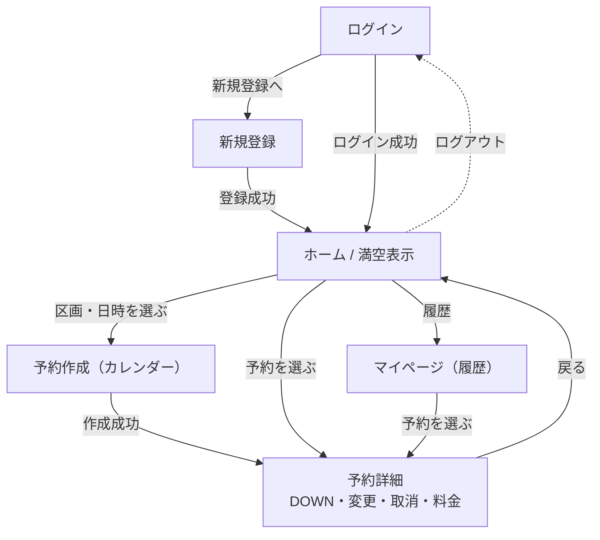
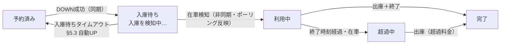

# 駐車場予約システム 画面設計・画面遷移図

要件 §9 の画面一覧を、Flutter の主要画面の遷移図と、各画面の構成要素・呼ぶ API（OpenAPI 対応）に展開したもの。

> 改訂：予約状態×アクションの活性表を追加（409 を出させない前向き制御）、DOWN 後の「入庫待ち」中間表示と更新方式を追加、conflict 文言・ログアウト時のトークン破棄・規約バージョン送信を明記。

## 画面遷移図

---

## 画面と構成要素・呼ぶ API

| 画面 | 主な構成要素 | 呼ぶ API |
| --- | --- | --- |
| ログイン | メール・パスワード入力、ログインボタン、新規登録への導線 | POST /auth/login |
| 新規登録 | メール・パスワード入力、規約同意チェック（**同意時点の terms_version を送信**）、登録ボタン | POST /auth/register |
| ホーム / 満空表示 | 区画リスト（満空・デバイス健全性）、日時選択、予約可否、予約への導線、ログアウト | GET /spots, GET /spots/availability |
| 予約作成（カレンダー） | 日時・区画の選択、内容確認、作成ボタン（見込み額表示） | POST /reservations |
| 予約詳細 | 予約情報、DOWN（入庫）ボタン、変更、キャンセル、利用終了、料金表示、エラー時の導線（状態で出し分け＝下表） | GET /reservations, POST …/gate-down, PUT …/{id}, DELETE …/{id}, POST …/finish, GET …/fee |
| マイページ（履歴） | 予約・利用履歴の一覧、各予約詳細への導線 | GET /reservations |

## 予約状態 × アクションの活性（予約詳細）

UI は状態に応じてボタンを非活性/非表示にし、OpenAPI で 409 になる操作を**そもそも出させない**。

| 予約状態 | 変更 | キャンセル | DOWN（入庫） | 利用終了 | 料金 |
| --- | --- | --- | --- | --- | --- |
| reserved（未入庫） | ○ | ○ | △（予約期間に入ってから活性） | × | × |
| 入庫待ち（DOWN 後・在車検知前） | × | × | ×（処理中表示） | × | × |
| active（在車中） | × | × | ○（再入庫） | ○ | △（pending） |
| overstay（超過中） | × | × | ○（再入庫） | ○ | △（超過込み pending） |
| completed（完了） | × | × | × | × | ○（確定表示） |
| cancelled / no_show | × | × | × | × | ×（表示のみ） |

○=活性、△=条件付き、×=非活性/非表示。変更・キャンセルが reserved のみなのは処理一覧・OpenAPI と一致。

## DOWN 後の状態反映（入庫待ち）

gate-down は同期で「ダウン成功」を返すが、active への遷移は在車検知（テレメトリ）経由で非同期。その間の「入庫待ち」を UI に反映する。

- DOWN 成功後は「板を下げました。入庫を検知中…」の**中間表示**にし、操作系は一旦非活性。
- active になったら「利用中」へ更新（下記の更新方式）。
- 入庫待ちタイムアウト（§5.3、DOWN 後に入庫が無いと自動 UP）に達したら「入庫が確認できませんでした。予約はそのままです」と表示し、reserved（予約済み）に戻す。

## 状態の更新方式（MVP）

- 満空・予約状態はサーバ側でテレメトリ/タイマーにより非同期に変わる。MVP は **画面表示時・操作後の再取得＋手動プルリフレッシュ**を基本とする。
- 入庫待ちの間だけは、active になるか入庫待ちタイムアウトに達するまで**短間隔ポーリング**で状態を取りにいく。ポーリングは「数秒に1回・最大数分で打ち切り」と上限を切り、SQL サーバーレスの自動停止（§12 #9）を無闇に削らないようにする（画面のポーリングも DB を起こす要因の一つ）。
- プッシュ通知は Phase 2（処理一覧で確定）。

## エラー UX（OpenAPI の `retryable`・`code` を UI 分岐に使う）

- **DOWN（gate-down）**：`Error.retryable` をそのまま分岐に使う。
  - 504（デバイス無応答, retryable=true）→ **再試行ボタン**。
  - 409（物理占有, retryable=false）→ 再試行は出さず、別区画選択やサポートへの導線。
  - 503（事前 NG, retryable=false）→ 「一時的にデバイス不調」の案内（時間をおく旨）。
- **予約作成（409）**：`Error.code` でメッセージを分岐。availability は best-effort（TOCTOU 許容, §8）なので、競合時は「直前に他の方が予約した可能性があります」と添えてユーザーの混乱を避ける。
  - `conflict_overlap` / `conflict_buffer` → 別の時間帯を提案。
  - `device_unhealthy` → 別区画を提案。
- **料金（fee）**：`status=pending` は「確定待ち」を表示し、確定後に再取得。

## 認証ゲーティング

- ログイン・新規登録以外の画面はアクセストークン必須。401 を受けたらログインへ遷移し、可能ならリフレッシュで復帰（認証設計 §3）。
- **ログアウト＝ローカル保持のトークン破棄（メモリ／セキュアストレージから確実に削除）＋ POST /auth/logout（refresh 失効）の両方**を行う。これが抜けると「ログアウト後も戻る操作で使える」事故になる。

## Phase 2 の画面（将来）

- 利用中の変更・延長（§12 #13）、通知設定、超過警告の表示など。